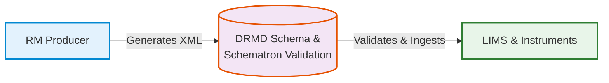

# Introduction & Overview

Welcome to the **Best Practice Guidelines** for the **Digital Reference Material Document (DRMD)**.

This guide provides comprehensive instructions for machine manufacturers, reference material producers, and software developers to ensure consistent, interoperable, and automated handling of DRMD certificates across different platforms.

!!! info "What is the DRMD?"
    The DRMD is a standardized XML-based format designed to digitally represent reference material certificates in strict compliance with **ISO 17034** (Competence of reference material producers) and **ISO 33401** (Reference materials - Guidance for characterization and assessment of homogeneity and stability).

## The DRMD Ecosystem

The DRMD schema transforms static PDF certificates into a machine-readable ecosystem. By moving to structured data, it enables:

- **Automated parsing** without manual data entry.
- **Seamless LIMS integration** for analytical laboratories.
- **Standardized data exchange** between producers and end-users.
- **Regulatory compliance** through structured traceability and uncertainty data.

### How it works

## Target Audience

This best practice guide is designed for multiple stakeholders across the quality infrastructure:

=== "Machine Manufacturers & Software"
    Developers of LIMS, ELN, and analytical instrument software who need to confidently import, parse, and process DRMD certificates.

=== "Reference Material Producers"
    Organizations certified according to ISO 17034 who generate and distribute DRMD certificates. This guide ensures your output achieves maximum interoperability.

=== "End-Users & Laboratories"
    Quality control departments and calibration facilities that load DRMD certificates into their systems and require a deep understanding of the certificate structure.

=== "Auditors & Regulators"
    Quality Assurance personnel responsible for verifying data integrity, cryptographic signatures, and maintaining audit trails for compliance.

---

## The 3-Tier Validation Model

To ensure machine-readability and compliance with ISO 33401:2024, the DRMD schema utilizes a powerful companion **Schematron** validation file (`drmd-business-rules.sch`). 

We have implemented a strict **3-Tier Severity Model** that maps directly to ISO requirement categories. When you validate an XML document, you will see one of the following outputs:

!!! failure "Hard Error (Must not accept)"
    **(ISO Requirement: Mandatory)**  
    If a document violates a Hard Error rule (e.g., missing a `titleOfTheDocument` or a mandatory `uniqueIdentifier`), it is completely non-compliant and must fail conformance validation.

!!! warning "Conditional Error"
    **(ISO Requirement: Mandatory whenever applicable)**  
    Rules that must be followed under specific conditions. For example, `procedures` must be documented whenever measurands are operationally defined. If the condition is met but the data is missing, validation fails.

!!! success "Warning (Advisory)"
    **(ISO Requirement: Recommended)**  
    The document is structurally valid, but is missing recommended fields (e.g., `healthAndSafetyInformation` or highest-tier D-SI unit classes). It is acceptable but reduces interoperability.

---

## How to read this guide

In the following chapters, we will break down the DRMD schema into its **Six Core Containers**, providing you with best-practice examples, XML snippets, and strict rules for implementation:

1. **Administrative Data**
2. **Materials**
3. **Properties List**
4. **Statements**
5. **Comments & Documents**
6. **Digital Signature**

Click **Next** below to dive into the Schema Overview & Architecture!
