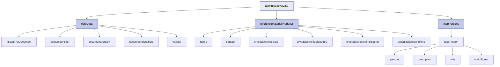
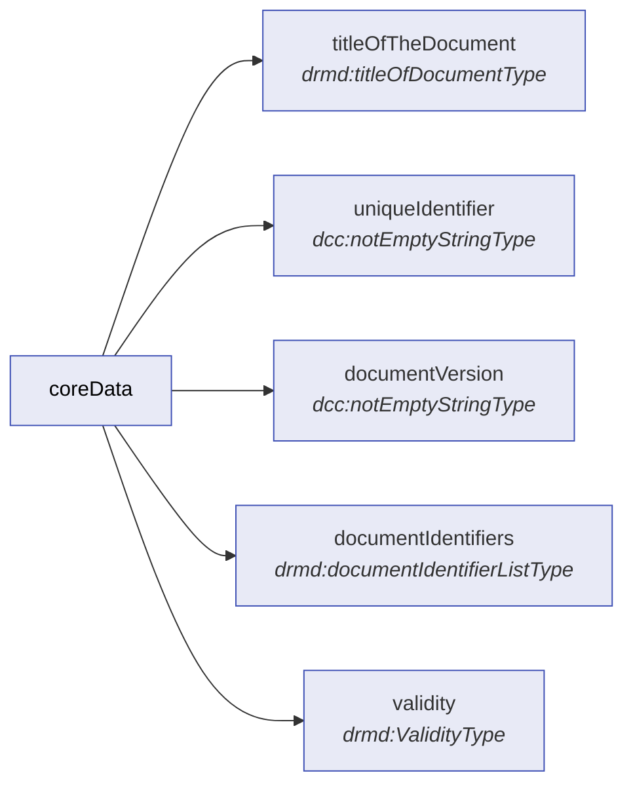
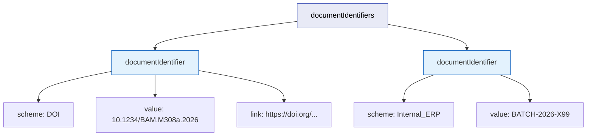
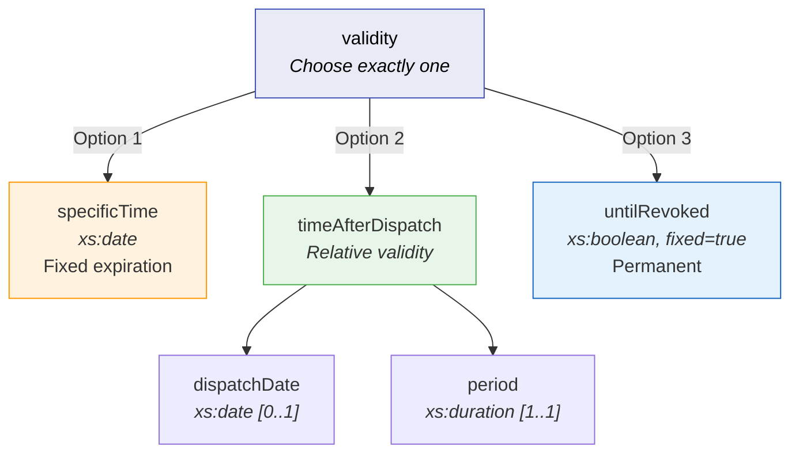
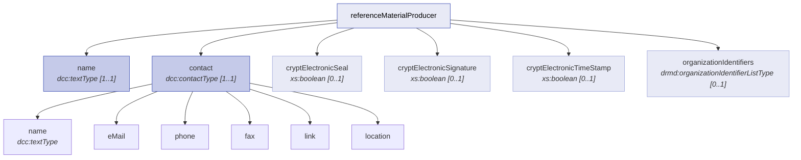
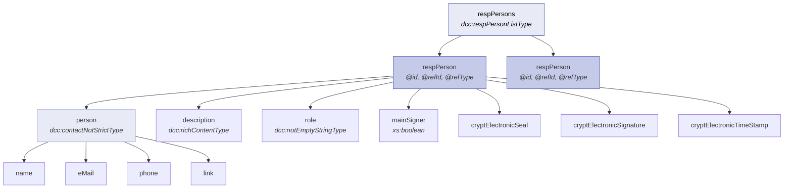

# Administrative Data

The **Administrative Data** block (`administrativeData`) is the structural backbone of every DRMD document. It serves as the **"digital container"** for the material, ensuring that any software, analytical instrument, or regulatory body can verify the document's authenticity, identify its producer, and confirm its valid lifespan — all **before** processing any technical measurement data.


## Structure at a Glance



The three pillars are:

| Pillar | Path | Type | Required |
|--------|------|------|----------|
| **Core Data** | `coreData` | `drmd:coreDataType` | Mandatory |
| **Reference Material Producer** | `referenceMaterialProducer` | `drmd:referenceMaterialProducerType` | Mandatory |
| **Responsible Persons** | `respPersons` | `dcc:respPersonListType` | CRM: Mandatory / PIS: Optional |

!!! warning "Dual Validation Required"
    The DRMD schema uses a **dual-profile architecture**. The XSD defines the structure, but profile-specific mandatory requirements (e.g., `respPersons` for CRM documents) are enforced by the companion **Schematron business rules** (`drmd-business-rules.sch`). Full compliance requires passing **both** validations.


## 3.1 Core Data (`coreData`)

The `coreData` pillar contains the primary metadata that identifies the document and its legal status. Think of it as the document's **passport**.




### 3.1.1 Title of the Document (`titleOfTheDocument`)

| Property | Value |
|----------|-------|
| **Path** | `.../coreData/drmd:titleOfTheDocument` |
| **Type** | `drmd:titleOfDocumentType` (restricts `xs:string`) |
| **Cardinality** | **Required** `[1..1]` |
| **Enumerations** | `referenceMaterialCertificate`, `productInformationSheet` |

**Purpose:** A mandatory classification that defines the **metrological level** of the document. It tells analytical instrument software how to weigh the data contained within.

???+ info "Understanding the Two Document Profiles"

    The `titleOfTheDocument` value drives the entire validation behavior of the DRMD. Choosing the wrong profile can lead to validation failures or, worse, incorrect interpretation of measurement data.

    === "referenceMaterialCertificate (CRM)"

        - Identifies a **Certified Reference Material** per ISO 33401:2024
        - Values are **certified** with full traceability and uncertainty budgets
        - Downstream data systems treat properties as suitable for **calibration**
        - **Additional mandatory requirements** are activated via Schematron:
            - `respPersons` with approving officer (RMC-010)
            - `metrologicalTraceability` statement (RMC-001)
            - At least one `properties` block with `@isCertified="true"` (RMC-002)
            - Material `description` (RMC-011)

    === "productInformationSheet"

        - Identifies an informative **Reference Material** per ISO 33401:2024
        - Values are valid measurement results but **not certified**
        - Should **not** be used as a primary anchor for calibration
        - Fewer mandatory requirements — `respPersons` is optional
        - `@isCertified` MUST NOT be set to `"true"` (PIS-001)

**XML Examples:**

```xml
<!-- For a Certified Reference Material (CRM) -->
<drmd:titleOfTheDocument>referenceMaterialCertificate</drmd:titleOfTheDocument>

<!-- For an informative Reference Material (RM) -->
<drmd:titleOfTheDocument>productInformationSheet</drmd:titleOfTheDocument>
```

!!! danger "Schematron Rule: DRMD-001"
    Every DRMD document **MUST** declare a `titleOfTheDocument` in `coreData`, specifying either `referenceMaterialCertificate` or `productInformationSheet`. Severity: **Error** — document is non-compliant without this element.


### 3.1.2 Unique Identifier (`uniqueIdentifier`)

| Property | Value |
|----------|-------|
| **Path** | `.../coreData/drmd:uniqueIdentifier` |
| **Type** | `dcc:notEmptyStringType` |
| **Cardinality** | **Required** `[1..1]` |

**Purpose:** A mandatory string that serves as the document's **digital fingerprint**. It prevents "ID collisions" in global databases and is used by Laboratory Information Management Systems (LIMS) for version control.

!!! tip "Best Practice"
    Use a standard **UUID v4** format. If the certificate is updated or re-issued, a **new** UUID must be generated — never reuse identifiers across revisions.

```xml
<drmd:uniqueIdentifier>84d58aee-4f81-460f-993e-a594ce3a8d60</drmd:uniqueIdentifier>
```


### 3.1.3 Document Version (`documentVersion`)

| Property | Value |
|----------|-------|
| **Path** | `.../coreData/drmd:documentVersion` |
| **Type** | `dcc:notEmptyStringType` |
| **Cardinality** | **Required** `[1..1]` |

**Purpose:** A mandatory version string identifying the revision of this document. Enables recipients to verify they hold the current version (ISO 33401:2024, §5.2.13).

```xml
<drmd:documentVersion>1.0.0</drmd:documentVersion>
```


### 3.1.4 Document Identifiers (`documentIdentifiers`)

| Property | Value |
|----------|-------|
| **Path** | `.../coreData/drmd:documentIdentifiers` |
| **Type** | `drmd:documentIdentifierListType` |
| **Cardinality** | **Optional** `[0..1]` |

**Purpose:** The digital **"Linkage Hub"** for the certificate, allowing it to be indexed and verified across different global and internal databases.



Each `documentIdentifier` contains:

| Child Element | Type | Required | Description |
|---------------|------|----------|-------------|
| `scheme` | `dcc:notEmptyStringType` | Yes | The naming system or authority (e.g., `"DOI"`, `"Internal_ERP"`) |
| `value` | `dcc:notEmptyStringType` | Yes | The actual unique code assigned by the authority |
| `link` | `xs:anyURI` | No | A URI/URL for immediate verification of origin |

**Technical Attributes:** `@id` (internal XML label), `@refId` (pointer to another ID), `@refType` (categorizes the nature — e.g., `basic_certificateIdentification`).

???+ example "Complete XML Example"

    ```xml
    <drmd:documentIdentifiers>
      <!-- Global DOI Identification -->
      <drmd:documentIdentifier id="ID_01" refType="basic_certificateIdentification">
        <drmd:scheme>DOI</drmd:scheme>
        <drmd:value>10.1234/BAM.M308a.2026</drmd:value>
        <drmd:link>https://doi.org/10.1234/BAM.M308a.2026</drmd:link>
      </drmd:documentIdentifier>

      <!-- Internal Business Tracking -->
      <drmd:documentIdentifier id="ID_02">
        <drmd:scheme>Internal_ERP</drmd:scheme>
        <drmd:value>BATCH-2026-X99</drmd:value>
      </drmd:documentIdentifier>
    </drmd:documentIdentifiers>
    ```


### 3.1.5 Validity (`validity`)

| Property | Value |
|----------|-------|
| **Path** | `.../coreData/drmd:validity` |
| **Type** | `drmd:ValidityType` |
| **Cardinality** | **Required** `[1..1]` |

**Purpose:** A mandatory **choice** that establishes the operational lifespan of the certificate. Producers must select **exactly one** of three methods. Instruments match this data block against real-time evaluation dates to automatically lock out expired materials.

!!! danger "Schematron Rule: DRMD-012"
    Every DRMD document **MUST** specify a validity period or condition (ISO 33401:2024, §5.2.8). Severity: **Error**.



=== "specificTime (Fixed Expiration)"

    A hard expiration date using the `YYYY-MM-DD` format. Provides a **"Hard Stop"** for safety — automated instruments compare this to the current date and **lock out** the material if expired.

    ```xml
    <drmd:validity>
      <drmd:specificTime>2040-12-31</drmd:specificTime>
    </drmd:validity>
    ```

=== "timeAfterDispatch (Relative Validity)"

    A dynamic duration defined by an optional `dispatchDate` and a mandatory ISO 8601 `period` (e.g., `P3Y` for 3 years). Accommodates materials where shelf-life only begins once shipped. Systems parse the period to **automatically calculate** a unique expiration date.

    !!! note "Policy Option"
        If DRMD's legal issuance is defined as the act of signing (not printing/dispatching), set `dispatchDate` to the date of the signing event. Only do this when signing time is explicitly your issuance time by regulation/process.

    ```xml
    <drmd:validity>
      <drmd:timeAfterDispatch>
        <drmd:dispatchDate>2026-04-20</drmd:dispatchDate>
        <drmd:period>P3Y2M</drmd:period> <!-- Valid for 3 years, 2 months -->
      </drmd:timeAfterDispatch>
    </drmd:validity>
    ```

=== "untilRevoked (Permanent Until Notice)"

    A boolean element fixed to the value `true`. Used for inherently stable materials that do not require a predetermined expiration date. The certificate remains active until a **revocation or updated version** is issued.

    ```xml
    <drmd:validity>
      <drmd:untilRevoked>true</drmd:untilRevoked>
    </drmd:validity>
    ```


## 3.2 Reference Material Producer (`referenceMaterialProducer`)

| Property | Value |
|----------|-------|
| **Path** | `.../administrativeData/drmd:referenceMaterialProducer` |
| **Type** | `drmd:referenceMaterialProducerType` |
| **Cardinality** | **Required** `[1..1]` |

This block identifies the organization **legally and operationally responsible** for producing (or issuing) the reference material and its documentation (e.g., BAM, NIST, IRMM).

!!! danger "Schematron Rule: DRMD-010"
    Every DRMD document **MUST** identify the `referenceMaterialProducer` (ISO 33401:2024, §5.2.5). Severity: **Error**.



??? abstract "Who Uses This Block?"

    | Stakeholder | How They Use It |
    |-------------|----------------|
    | **RM Producer / Issuing Organization** | Provides authoritative identity; enables consistent re-use of metadata across many DRMDs |
    | **Laboratories / Customers** | Verifies the issuer and finds official contact details to confirm provenance |
    | **Software Developers** | Renders the "Producer block" consistently; uses identifiers as stable keys for deduplication |
    | **Machine / Instrument Manufacturers** | Links results to producer identity for QA workflows and LIMS integration |
    | **Auditors / Regulators** | Validates issuer identity and supports regulatory compliance |


### 3.2.1 Name

| Property | Value |
|----------|-------|
| **Path** | `.../referenceMaterialProducer/drmd:name` |
| **Type** | `dcc:textType` |
| **Cardinality** | **Required** `[1..1]` |

A multilingual "human-friendly" name of the producer. As a `dcc:textType`, it holds one or more `dcc:content` elements where the `@lang` attribute follows ISO-639-1.

!!! tip "Best Practices"
    - Provide at least one `dcc:content`
    - For international publications, provide multiple languages (e.g., `en`, `de`)
    - Use the official long form; avoid abbreviations unless included separately

```xml
<drmd:name>
  <dcc:content lang="en">Federal Institute for Materials Research and Testing (BAM)</dcc:content>
  <dcc:content lang="de">Bundesanstalt fuer Materialforschung und -pruefung (BAM)</dcc:content>
</drmd:name>
```


### 3.2.2 Contact

| Property | Value |
|----------|-------|
| **Path** | `.../referenceMaterialProducer/drmd:contact` |
| **Type** | `dcc:contactType` |
| **Cardinality** | **Required** `[1..1]` |

A structured contact block essential for requesting value clarifications, handling instructions, or additional documentation.

**Contact sub-elements:**

| Element | Type | Required | Notes |
|---------|------|----------|-------|
| `dcc:name` | `dcc:textType` | Yes | Department or team name |
| `dcc:eMail` | `dcc:notEmptyStringType` | No | Always provide at least email or phone |
| `dcc:phone` | `dcc:notEmptyStringType` | No | |
| `dcc:fax` | `dcc:notEmptyStringType` | No | Legacy, but schema-supported |
| `dcc:link` | `xs:anyURI` | No | Organization website |
| `dcc:location` | `dcc:locationType` | Yes | Physical address with `countryCode` (ISO 3166-1) recommended |

???+ example "Complete Contact XML Example"

    ```xml
    <drmd:contact>
      <dcc:name>
        <dcc:content lang="en">BAM Sales / CRM</dcc:content>
      </dcc:name>
      <dcc:eMail>sales.crm@bam.de</dcc:eMail>
      <dcc:phone>+49 30 8104 2061</dcc:phone>
      <dcc:fax>+49 30 8104 72061</dcc:fax>
      <dcc:link>https://www.bam.de/</dcc:link>
      <dcc:location>
        <dcc:street>Richard-Willstaetter-Str.</dcc:street>
        <dcc:streetNo>11</dcc:streetNo>
        <dcc:postCode>12489</dcc:postCode>
        <dcc:city>Berlin</dcc:city>
        <dcc:countryCode>DE</dcc:countryCode>
        <dcc:positionCoordinates>
          <dcc:positionCoordinateSystem>WGS84</dcc:positionCoordinateSystem>
          <dcc:positionCoordinate1>
            <si:label>latitude</si:label>
            <si:value>52.4319</si:value>
            <si:unit>deg</si:unit>
          </dcc:positionCoordinate1>
          <dcc:positionCoordinate2>
            <si:label>longitude</si:label>
            <si:value>13.5330</si:value>
            <si:unit>deg</si:unit>
          </dcc:positionCoordinate2>
        </dcc:positionCoordinates>
      </dcc:location>
    </drmd:contact>
    ```


### 3.2.3 descriptionData (Optional Attachment)

| Property | Value |
|----------|-------|
| **Path** | `.../contact/dcc:descriptionData` |
| **Type** | `dcc:byteDataType` |
| **Cardinality** | **Optional** `[0..1]` |

Used to attach small binary artifacts such as a **vCard** (`text/vcard`) or an organization **logo** (PNG/SVG).

```xml
<dcc:descriptionData>
  <dcc:fileName>producer-contact.vcf</dcc:fileName>
  <dcc:mimeType>text/vcard</dcc:mimeType>
  <dcc:dataBase64>BASE64_ENCODED_BYTES_HERE==</dcc:dataBase64>
</dcc:descriptionData>
```


### 3.2.4 Cryptographic Capability Flags (Optional Booleans)

These flags are **capability / policy hints**, not proofs. They help consumers know what to expect from the producer's trust infrastructure.

| Element | Type | Meaning |
|---------|------|---------|
| `cryptElectronicSeal` | `xs:boolean` | Organization-level sealing (often for automated issuing) |
| `cryptElectronicSignature` | `xs:boolean` | Person-based signing workflows |
| `cryptElectronicTimeStamp` | `xs:boolean` | Time-stamping services used for long-term validity |

??? abstract "Who Uses These Flags?"

    | Stakeholder | Usage |
    |-------------|-------|
    | **Producers** | Declare available trust mechanisms |
    | **Consumers** | Decide if additional manual verification is needed |
    | **Software Developers** | Decide whether to show validation UI and "digitally signed" expectations |

!!! tip "Best Practice"
    Use `true`/`false` explicitly only when you are confident. **Omit the element** if unknown rather than guessing.

```xml
<drmd:cryptElectronicSeal>true</drmd:cryptElectronicSeal>
<drmd:cryptElectronicSignature>false</drmd:cryptElectronicSignature>
<drmd:cryptElectronicTimeStamp>true</drmd:cryptElectronicTimeStamp>
```


### 3.2.5 Organization Identifiers (Optional List)

| Property | Value |
|----------|-------|
| **Path** | `.../referenceMaterialProducer/drmd:organizationIdentifiers` |
| **Type** | `drmd:organizationIdentifierListType` |
| **Cardinality** | **Optional** `[0..1]` |

A mechanism to assign **stable external identifiers** to the organization, enabling unambiguous machine linking across global systems.

Each `organizationIdentifier` contains: `scheme` (Required), `value` (Required), `link` (Optional), plus `@id`, `@refId`, `@refType` attributes.

**Recommended Schemes:**

| Scheme | Description | Example |
|--------|-------------|---------|
| `ROR` | Research Organization Registry | `02h2x7d13` |
| `VAT` | EU VAT Number | `DE123456789` |
| `LEI` | Legal Entity Identifier | `529900T8BM49AURSDO55` |
| National registers | Company register or authority IDs | — |

!!! tip "Best Practices"
    - Prefer globally resolvable IDs (e.g., ROR + link)
    - Use `link` whenever there is a canonical resolver URL
    - Keep the `scheme` short and stable; do not use long prose

???+ example "Organization Identifiers XML"

    ```xml
    <drmd:organizationIdentifiers>
      <drmd:organizationIdentifier>
        <drmd:scheme>ROR</drmd:scheme>
        <drmd:value>02h2x7d13</drmd:value>
        <drmd:link>https://ror.org/02h2x7d13</drmd:link>
      </drmd:organizationIdentifier>

      <drmd:organizationIdentifier>
        <drmd:scheme>VAT</drmd:scheme>
        <drmd:value>DE123456789</drmd:value>
      </drmd:organizationIdentifier>
    </drmd:organizationIdentifiers>
    ```


## 3.3 Responsible Persons (`respPersons`)

| Property | Value |
|----------|-------|
| **Path** | `.../administrativeData/drmd:respPersons` |
| **Type** | `dcc:respPersonListType` (imported from DCC schema) |
| **Cardinality** | CRM: **Mandatory** / ProductInformationSheet: **Optional** `[0..1]` |

The **Responsible Persons** block records the human (or organizational) accountability for the DRMD: who prepared it, who approved it, and who is authorized to perform electronic signatures.

!!! danger "Schematron Rule: RMC-010"
    Reference Material Certificates **MUST** list responsible persons including the name and function of the RM producer's approving officer (ISO 33401:2024, §5.3.5). Severity: **Error**. This rule does **not** apply to `productInformationSheet` documents.



??? abstract "Who Uses This Block?"

    | Stakeholder | Usage |
    |-------------|-------|
    | **RM Producer** | Internal governance, traceability of approvals, auditability, and responsibility assignment |
    | **Regulators / Accreditation Bodies / Auditors** | Clear accountability and roles |
    | **Software Developers / Platform Operators** | Consistent identity anchors (`@id`) and re-use via references (`@refId`) across sections |
    | **Downstream Users (Labs, Customers)** | Know who approved/certified the DRMD and how to reach them |


### 3.3.1 Responsible Person Entry (`respPerson`)

Each `dcc:respPerson` entry captures **who is responsible** and optionally **what role they play**.

**Attributes (identity & linking):**

| Attribute | Type | Purpose |
|-----------|------|---------|
| `@id` | `xs:ID` | Unique identifier within the XML document (e.g., `respPerson_1`) |
| `@refId` | `xs:IDREFS` | References IDs defined elsewhere to avoid duplication |
| `@refType` | `dcc:refTypesType` | Classifies the reference relationship |

**Child Elements:**

| Element | Type | Required | Description |
|---------|------|----------|-------------|
| `dcc:person` | `dcc:contactNotStrictType` | **Yes** | Identity and contact data (location is optional) |
| `dcc:description` | `dcc:richContentType` | No | Human-readable responsibilities, expertise, department |
| `dcc:role` | `dcc:notEmptyStringType` | No | Short role label (e.g., `"Head of Department 1"`) |
| `dcc:mainSigner` | `xs:boolean` | No | Flags the primary signer among multiple persons |
| `dcc:cryptElectronicSeal` | `xs:boolean` | No | Workflow hint: sealing capability |
| `dcc:cryptElectronicSignature` | `xs:boolean` | No | Workflow hint: signing capability |
| `dcc:cryptElectronicTimeStamp` | `xs:boolean` | No | Workflow hint: timestamping capability |

!!! tip "Best Practice"
    If you have a signing workflow, set exactly **one** `mainSigner=true`. Always set `@id` so other elements can reference the person consistently.


### 3.3.2 Person Details (`dcc:person`)

The `dcc:person` element uses type `dcc:contactNotStrictType`, meaning **location is optional** (unlike `dcc:contactType` where location is required).

| Element | Type | Required | Notes |
|---------|------|----------|-------|
| `dcc:name` | `dcc:textType` | **Yes** | Multilingual structured text |
| `dcc:eMail` | `dcc:notEmptyStringType` | No | Email contact |
| `dcc:phone` | `dcc:notEmptyStringType` | No | Phone contact |
| `dcc:fax` | `dcc:notEmptyStringType` | No | Fax (legacy, supported) |
| `dcc:link` | `xs:anyURI` | No | ORCID page, institutional directory, etc. |
| `dcc:location` | `dcc:locationType` | No | Optional address/affiliation |
| `dcc:descriptionData` | `dcc:byteDataType` | No | Binary attachment (vCard, mandate PDF, etc.) |


### 3.3.3 Complete Responsible Persons Example

???+ example "Full XML Example with Two Responsible Persons"

    ```xml
    <drmd:respPersons>
      <!-- Primary Approving Officer -->
      <dcc:respPerson id="respPerson_1" refType="basic_certificateIdentification">
        <dcc:person>
          <dcc:name>
            <dcc:content lang="en">Dr. F. Emmerling</dcc:content>
          </dcc:name>
          <dcc:eMail>f.emmerling@example.org</dcc:eMail>
          <dcc:phone>+49 30 8104 0000</dcc:phone>
          <dcc:link>https://www.example.org/staff/emmerling</dcc:link>
        </dcc:person>
        <dcc:description>
          <dcc:content lang="en">Analytical Chemistry; Reference Materials</dcc:content>
        </dcc:description>
        <dcc:role>Head of Department 1</dcc:role>
        <dcc:mainSigner>true</dcc:mainSigner>
        <dcc:cryptElectronicSeal>true</dcc:cryptElectronicSeal>
        <dcc:cryptElectronicSignature>true</dcc:cryptElectronicSignature>
        <dcc:cryptElectronicTimeStamp>true</dcc:cryptElectronicTimeStamp>
      </dcc:respPerson>

      <!-- Secondary Technical Reviewer -->
      <dcc:respPerson id="respPerson_2"
                      refId="respPerson_1"
                      refType="basic_certificateIdentification">
        <dcc:person>
          <dcc:name>
            <dcc:content lang="en">Dr. S. Recknagel</dcc:content>
          </dcc:name>
          <dcc:eMail>sebastian.recknagel@example.org</dcc:eMail>
          <dcc:phone>+49 30 8104 1160</dcc:phone>
        </dcc:person>
        <dcc:description>
          <dcc:content lang="en">Specialist in Inorganic Reference Materials</dcc:content>
        </dcc:description>
        <dcc:role>Head of Division 1.6</dcc:role>
        <dcc:mainSigner>false</dcc:mainSigner>
        <dcc:cryptElectronicSignature>true</dcc:cryptElectronicSignature>
        <dcc:cryptElectronicTimeStamp>true</dcc:cryptElectronicTimeStamp>
      </dcc:respPerson>
    </drmd:respPersons>
    ```


## Business Rules Summary

The following Schematron business rules apply specifically to the **Administrative Data** block. Full compliance requires passing both XSD and Schematron validation.

| Rule ID | Scope | Severity | Description |
|---------|-------|----------|-------------|
| **DRMD-001** | All documents | Error | Must declare `titleOfTheDocument` |
| **DRMD-010** | All documents | Error | Must identify `referenceMaterialProducer` |
| **DRMD-012** | All documents | Error | Must specify a `validity` period or condition |
| **RMC-010** | CRM only | Error | Must list `respPersons` with approving officer |

!!! info "Validation Pipeline"
    ```
    Step 1: Validate against drmd.xsd         → Structural validation
    Step 2: Validate against drmd-business-rules.sch → Business rule validation
    Both steps MUST pass for a document to be considered fully compliant.
    ```


## Complete Administrative Data Example

??? example "Full administrativeData Block (Click to Expand)"

    ```xml
    <drmd:administrativeData>
      <!-- === Core Data === -->
      <drmd:coreData>
        <drmd:titleOfTheDocument>referenceMaterialCertificate</drmd:titleOfTheDocument>
        <drmd:uniqueIdentifier>84d58aee-4f81-460f-993e-a594ce3a8d60</drmd:uniqueIdentifier>
        <drmd:documentVersion>1.0.0</drmd:documentVersion>

        <drmd:documentIdentifiers>
          <drmd:documentIdentifier id="ID_01" refType="basic_certificateIdentification">
            <drmd:scheme>DOI</drmd:scheme>
            <drmd:value>10.1234/BAM.M308a.2026</drmd:value>
            <drmd:link>https://doi.org/10.1234/BAM.M308a.2026</drmd:link>
          </drmd:documentIdentifier>
        </drmd:documentIdentifiers>

        <drmd:validity>
          <drmd:untilRevoked>true</drmd:untilRevoked>
        </drmd:validity>
      </drmd:coreData>

      <!-- === Reference Material Producer === -->
      <drmd:referenceMaterialProducer>
        <drmd:name>
          <dcc:content lang="en">Federal Institute for Materials Research and Testing (BAM)</dcc:content>
          <dcc:content lang="de">Bundesanstalt fuer Materialforschung und -pruefung (BAM)</dcc:content>
        </drmd:name>

        <drmd:contact>
          <dcc:name>
            <dcc:content lang="en">BAM Sales / CRM</dcc:content>
          </dcc:name>
          <dcc:eMail>sales.crm@bam.de</dcc:eMail>
          <dcc:phone>+49 30 8104 2061</dcc:phone>
          <dcc:link>https://www.bam.de/</dcc:link>
          <dcc:location>
            <dcc:street>Richard-Willstaetter-Str.</dcc:street>
            <dcc:streetNo>11</dcc:streetNo>
            <dcc:postCode>12489</dcc:postCode>
            <dcc:city>Berlin</dcc:city>
            <dcc:countryCode>DE</dcc:countryCode>
          </dcc:location>
        </drmd:contact>

        <drmd:cryptElectronicSeal>true</drmd:cryptElectronicSeal>
        <drmd:cryptElectronicSignature>false</drmd:cryptElectronicSignature>
        <drmd:cryptElectronicTimeStamp>true</drmd:cryptElectronicTimeStamp>

        <drmd:organizationIdentifiers>
          <drmd:organizationIdentifier>
            <drmd:scheme>ROR</drmd:scheme>
            <drmd:value>02h2x7d13</drmd:value>
            <drmd:link>https://ror.org/02h2x7d13</drmd:link>
          </drmd:organizationIdentifier>
        </drmd:organizationIdentifiers>
      </drmd:referenceMaterialProducer>

      <!-- === Responsible Persons === -->
      <drmd:respPersons>
        <dcc:respPerson id="respPerson_1" refType="basic_certificateIdentification">
          <dcc:person>
            <dcc:name>
              <dcc:content lang="en">Dr. F. Emmerling</dcc:content>
            </dcc:name>
            <dcc:eMail>f.emmerling@example.org</dcc:eMail>
          </dcc:person>
          <dcc:role>Head of Department 1</dcc:role>
          <dcc:mainSigner>true</dcc:mainSigner>
        </dcc:respPerson>
      </drmd:respPersons>
    </drmd:administrativeData>
    ```
