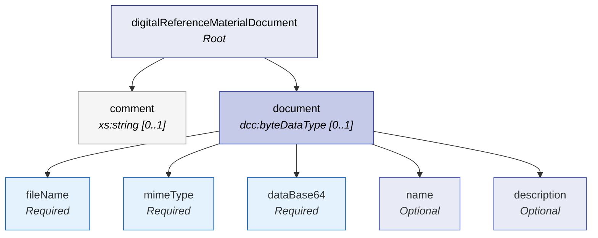

# Comments and Documents

The **Comments and Documents** chapter covers two optional, document-level add-ons that exist at the root of the DRMD structure. They apply to the DRMD as a whole, rather than being nested inside Materials or Properties:

- **`comment`**: A simple free-text note field intended for short, non-structured remarks about the DRMD instance.
- **`document`**: An embedded binary file container (typically used to attach a PDF rendition of the DRMD/certificate directly inside the XML).

## Structure at a Glance

Both of these elements sit directly under the `digitalReferenceMaterialDocument` root.



!!! note "Validation Context"
    Because these elements are fundamentally optional and act as supplementary metadata, there are no strict Schematron business rules that mandate their presence in either the CRM or PIS document profiles. 

---

## 7.1 Purpose and Use

| Stakeholder | How They Use Comments and Documents |
|-------------|-------------------------------------|
| **Reference Material Producer (RMP)** | Uses `document` to deliver a human-readable official PDF alongside the machine-readable XML in a single package. Uses `comment` for brief editorial or operational notes. |
| **Laboratories / End Users** | Can store one single artifact (the XML file) while still having access to the official PDF without needing a separate download. Use `comment` for quick notes in archives (e.g., "Imported into LIMS on [Date]"). |
| **Instrument / Machine Manufacturers** | Usually ignore `document` for calculations, but may display it as a "View Certificate PDF" button. May show `comment` in UI logs or debug screens. |
| **Software Developers / LIMS** | `document` provides a canonical embedded file to store, checksum, and present to users. `comment` is parsed as a simple string for operational notes. |
| **Regulators / Auditors** | `document` provides the signed/issued PDF representation as evidence, stored together with the structured XML data. |

---

## 7.2 Comment (`comment`)

| Property | Value |
|----------|-------|
| **Path** | `/drmd:digitalReferenceMaterialDocument/drmd:comment` |
| **Schema Type** | `xs:string` |
| **Cardinality** | **Optional** `[0..1]` |

A short, document-level free-text note. 

!!! warning "Limitations"
    Unlike `dcc:textType` or `dcc:richContentType`, the `comment` field is **not multilingual** and **does not support attachments**. 

!!! tip "Best Practices"
    - Keep it short and non-normative (e.g., import notes, processing notes).
    - **Do not** put required guidance here (intended use, storage, and handling belong in the `Statements` chapter).
    - **Do not** put machine-relevant identifiers here (use identifier lists in the proper chapters).
    - **Do not** use this for legally relevant statements.

### 7.2.1 Example

```xml
<drmd:comment>
  Imported into LIMS on 2026-05-07. PDF attachment included as drmd:document.
</drmd:comment>
```

---

## 7.3 Document (`document`)

| Property | Value |
|----------|-------|
| **Path** | `/drmd:digitalReferenceMaterialDocument/drmd:document` |
| **Schema Type** | `dcc:byteDataType` |
| **Cardinality** | **Optional** `[0..1]` |

An embedded file container, most commonly used to include a PDF version of the DRMD/certificate in Base64 encoding. This is a **document-level attachment** (applies to the whole DRMD), in contrast to attachments embedded inside specific statement fields via `dcc:richContentType`.

### 7.3.1 Structure

Inside `drmd:document`, the following sequence of elements is used:

| Element | Required | Description |
|---------|----------|-------------|
| **fileName** | Yes | Original or recommended file name (e.g., `BAM-M308a-certificate.pdf`). Include extension matching MIME type. |
| **mimeType** | Yes | File media type (e.g., `application/pdf`). Use standard MIME types. |
| **dataBase64** | Yes | The file bytes encoded as base64. Embed the exact bytes of the authoritative PDF. |
| **name** | No | Multilingual label for the embedded document. |
| **description** | No | Short description of what the embedded file represents. |

**Optional attributes on `drmd:document`:**
- `@id`: Recommended if you reference the embedded document elsewhere via `@refId`.
- `@refId`: References other IDs (if you use a linking convention).
- `@refType`: Only if you have a consistent internal meaning.

!!! tip "Best Practices"
    - Use this element to embed the **official human-readable representation** (usually a PDF).
    - Prefer **one document here** (the canonical one). Put supplementary documents (like SDS or technical drawings) into the relevant `Statements` chapter sections as localized attachments.
    - Ensure the embedded PDF **matches the content and version** of the XML to avoid mismatched revisions.
    - **Consider size/performance:** Base64 encoding increases file size. If the PDF is extremely large, some ecosystems prefer external linking instead of embedding.

### 7.3.2 Example

```xml
<drmd:document id="doc_pdf_certificate">
  <dcc:name>
    <dcc:content lang="en">Certificate PDF</dcc:content>
    <dcc:content lang="de">Zertifikat (PDF)</dcc:content>
  </dcc:name>
  <dcc:description>
    <dcc:content lang="en">
      Human-readable PDF rendition of this DRMD instance.
    </dcc:content>
  </dcc:description>
  <dcc:fileName>BAM-M308a-certificate.pdf</dcc:fileName>
  <dcc:mimeType>application/pdf</dcc:mimeType>
  <dcc:dataBase64>JVBERi0xLjQKJcTl8uXrp...BASE64_BYTES_HERE...==</dcc:dataBase64>
</drmd:document>
```
