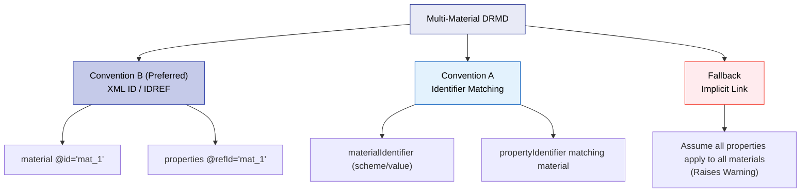

# Cross-reference & Identifier Conventions

The DRMD schema provides identifier structures and optional XML linking attributes (`@id`, `@refId`, `@refType`), but it does not strictly enforce a single linking model. Without agreed conventions, different software systems may interpret the same DRMD differently.

The goal of these conventions is to ensure that:
- Materials can be identified reliably across systems.
- Properties (measurands/analytes) can be mapped unambiguously.
- Multi-material documents can be processed deterministically.
- Automated imports do not create duplicate records in LIMS or instrument libraries.

!!! note "Validation Context"
    These are best-practice architecture rules for software implementation. They are not strictly enforced by Schematron rules, but following them is critical for Profile A and Profile B interoperability.

---

## 10.1 Canonical Keys (Stable Identifiers)

For any identifier element of type `drmd:identifierType`, the **canonical machine key** is always a tuple:

`CanonicalKey = (scheme, value)`

These two fields are mandatory in the schema. Relevant locations include:
- `documentIdentifiers`
- `materialIdentifiers`
- `organizationIdentifiers`
- `propertyIdentifiers`

### 10.1.1 Normalization (Recommended)

To improve matching across systems, consumers SHOULD normalize identifiers during ingestion:

| Field | Normalization Rule |
|-------|--------------------|
| `scheme` | Trim whitespace; compare case-insensitively (unless the publisher explicitly uses case-sensitive schemes). |
| `value` | Trim whitespace; preserve the original string; compare according to the specific scheme's rules (some values are case-sensitive). |

**Producers SHOULD avoid:**
- Using multiple spellings for the same scheme (e.g., mixing "CAS", "cas", and "CASRN").
- Placing human-readable descriptions inside the `value` element.

### 10.1.2 The Optional Link
`drmd:identifierType/link` SHOULD be used when there is a stable public resolver (e.g., DOI URL, ROR URL, CAS link). Consumers MAY use `link` for UI display, but **MUST NOT** rely on it for canonical identity matching.

---

## 10.2 Linking Multi-Material Documents

If a DRMD contains multiple materials, software needs to know which `properties` block applies to which `material`. The schema doesn't force a specific link, so you must use one of the following conventions:

### Convention B (Preferred for Implementation)
- Producers SHOULD include an `@id` attribute on each `drmd:material`.
- Producers SHOULD include a matching reference to that material in the relevant `drmd:properties` block by using `@refId`.

### Convention A (Identifier matching)
- Each `drmd:properties` block SHOULD indicate the target material by including at least one `propertyIdentifier` that identically matches the material's scope, using an agreed scheme.

!!! warning "Ambiguity Warning"
    If there are multiple materials and no explicit linking convention is used, consumers SHOULD treat the document as ambiguous and raise a validation warning.

---

## 10.3 Property Identifiers (Measurand/Analyte Identity)

Property identifiers allow software to map measured/certified values to precise analytes (e.g., Pb, Cd), measurands (e.g., mass fraction), or standardized nomenclatures (CAS, InChI).

| Property | Value |
|----------|-------|
| **Path** | `.../drmd:quantity/drmd:propertyIdentifiers/drmd:propertyIdentifier` |
| **Type** | `drmd:identifierType` |

### 10.3.1 Recommended Rules
- For each property represented as a `drmd:quantity`, producers SHOULD provide at least one `propertyIdentifier`.
- For compositional tables (`drmd:list`), provide one `propertyIdentifier` per row.
- **Recommended schemes:**
    - `CAS` (CAS Registry Number) for chemical substances.
    - `InChI` or `InChIKey` for chemical identity.
    - Element symbol (e.g., `scheme: IUPAC_element_symbol`, `value: Fe`).

---

## 10.4 Duplicate Prevention & Merge Rules (Imports)

When importing a DRMD into a LIMS or repository, software must prevent duplicates. 

### 10.4.1 Material Deduplication Priority
Consumers SHOULD match incoming materials against existing database records using the following priority order:
1. `coreData/uniqueIdentifier` (Document identity).
2. `materialIdentifiers` canonical keys `(scheme, value)`.
3. *Fallback:* Normalized `material/name` text (least reliable).

### 10.4.2 Property Deduplication Priority
Consumers SHOULD match properties within a material using:
1. `propertyIdentifiers` canonical keys `(scheme, value)` (Preferred).
2. *Fallback:* Quantity name text (if provided), but treat this as potentially non-unique.

### 10.4.3 Merge Behavior
If an incoming DRMD matches an existing record:
- Consumers SHOULD merge identifiers (creating a union of the identifier sets).
- Consumers **SHOULD NOT overwrite certified values silently.** If numeric values differ, treat the import as a new version or flag a conflict requiring user confirmation.

### 10.4.4 Collision Handling
If two *different* entities share the exact same `(scheme, value)` unintentionally:
- Consumers SHOULD flag this as a strict validation error.
- Producers SHOULD correct the identifiers to restore global uniqueness.
