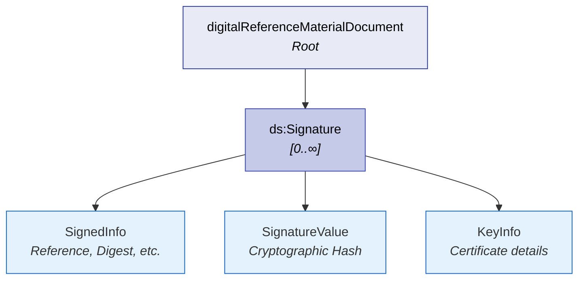

# Digital Signature

The **Digital Signature** section allows the DRMD to carry one or more XML Digital Signature blocks (`ds:Signature`) at the document root. A digital signature is used to protect:

- **Authenticity**: Verifying who issued/signed the document.
- **Integrity**: Guaranteeing that the XML content has not been modified after signing.
- **Non-repudiation / Auditability**: Providing verifiable evidence depending on organizational policy and legal frameworks.

In the DRMD schema, `ds:Signature` is **optional and repeatable**, enabling multiple signatures (e.g., a producer seal plus a responsible person's signature).

## Structure at a Glance



---

## 8.1 Purpose and Use

| Stakeholder | How They Use Digital Signatures |
|-------------|---------------------------------|
| **Reference Material Producer (RMP)** | Digitally seals the DRMD to make the XML an authoritative, tamper-evident certificate artifact. Supports controlled issuance and traceability for revisions. |
| **Laboratories / End Users** | Verify that the DRMD came from the expected producer and was not altered. Store and present verifiable evidence in audits/accreditation processes. |
| **Software Developers / LIMS** | Automate signature verification on import. Enforce policies such as: "only accept certified values if the signature validates." |
| **Regulators / Auditors** | Use signature verification as part of evidence review and trust establishment. |
| **Instrument / Machine Manufacturers** | Optionally verify the signature to ensure calibration libraries are loaded from trusted sources. |

---

## 8.2 Schema and Offline Validation

| Property | Value |
|----------|-------|
| **Element** | `ds:Signature` |
| **Path** | `/drmd:digitalReferenceMaterialDocument/ds:Signature` |
| **Cardinality** | `[0..∞]` (Optional, multiple signatures allowed) |

!!! danger "Important note about the XMLDSig schema stub"
    The DRMD schema imports a minimal stub (`xmldsig-core-schema.xsd`) for offline validation. In that stub, `ds:SignatureType` allows any content (`xs:any`, `processContents="lax"`).
    
    Consequently, the XSD will not enforce the real XMLDSig structure (e.g., `SignedInfo`, `SignatureValue`, `KeyInfo`). This is intentional for offline validation, but it means:
    
    1. **Schema validity ≠ cryptographic validity.**
    2. A document can be "XSD-valid" while containing a non-functional or malformed signature block.

---

## 8.3 Recommended Signing Patterns

### One signature by producer (Recommended Default)
Add exactly **one** `ds:Signature` created with the producer's organizational certificate (electronic seal). 
*Why it is recommended:* It provides a clear trust anchor ("issued by the producer"), creates an easy verification policy for consumers, and minimizes ambiguity.

### Multiple signatures (When needed)
Use multiple `ds:Signature` blocks if you have a defined governance model, such as:
- Producer organizational seal **AND** signature by a responsible person.
- Timestamping authority signature.

*Best practice:* If multiple signatures exist, explicitly document your verification rule for consumers (e.g., "at least one producer seal must validate").

### What to sign?
- **Sign the whole document (Recommended):** The safest default is to sign the entire DRMD root element content so that materials, properties, statements, and attachments are all integrity-protected.
- **Include embedded documents carefully:** Signing the whole XML will also protect embedded PDFs (`drmd:document`). *Note that this increases signature verification cost due to document size.*
- **Operational best practice:** If performance becomes an issue, consider keeping `drmd:document` external (linked) and sign a hash of it elsewhere, OR keep the embedded PDF and accept the higher verification cost.

---

## 8.4 Stub vs Production XMLDSig Validation

### Offline validation (with XSD stub)
- Use XSD validation to ensure `ds:Signature` is allowed and placed in the correct location.
- **Do not** treat success of XSD validation as evidence of authentic signing.

### Production validation (real signature verification)
In production systems, signature validation must be cryptographic and policy-driven:
- Use a full XMLDSig library (and preferably canonical XML processing).
- Validate the signature cryptographically, the certificate chain/trust store, and the revocation status (CRL/OCSP).
- **Best practice policy statement:** "Accept DRMD as certified only if at least one trusted producer signature validates successfully."

---

## 8.5 Best Practices & Example

!!! tip "Key Takeaways"
    - Prefer exactly one producer signature unless multi-signature is required.
    - Define and publish a verification policy (trusted certificates, timestamp requirements, etc.).
    - Ensure signing happens **after** the document is finalized (avoid post-sign modifications).
    - If you publish a PDF in `drmd:document`, ensure it corresponds to the same version as the XML and that both are included in the signed scope.

### Example Structure

```xml
<ds:Signature xmlns:ds="http://www.w3.org/2000/09/xmldsig#">
  <!-- Real XMLDSig content goes here -->
  <ds:SignedInfo>
    <ds:CanonicalizationMethod Algorithm="http://www.w3.org/2001/10/xml-exc-c14n#"/>
    <ds:SignatureMethod Algorithm="http://www.w3.org/2001/04/xmldsig-more#rsa-sha256"/>
    <ds:Reference URI="">
      <ds:Transforms>
        <ds:Transform Algorithm="http://www.w3.org/2000/09/xmldsig#enveloped-signature"/>
      </ds:Transforms>
      <ds:DigestMethod Algorithm="http://www.w3.org/2001/04/xmlenc#sha256"/>
      <ds:DigestValue>...</ds:DigestValue>
    </ds:Reference>
  </ds:SignedInfo>
  <ds:SignatureValue>...</ds:SignatureValue>
  <ds:KeyInfo>
    <ds:X509Data>
      <ds:X509Certificate>...</ds:X509Certificate>
    </ds:X509Data>
  </ds:KeyInfo>
</ds:Signature>
```
