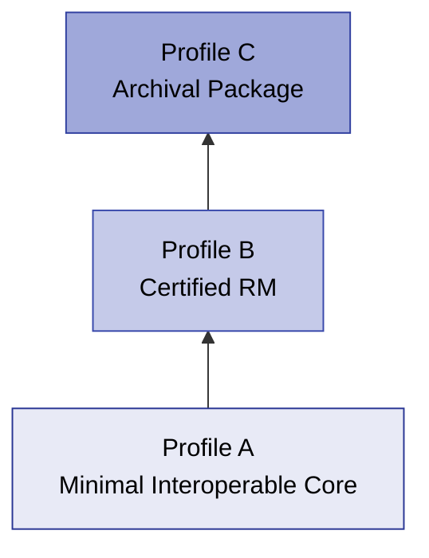

# Interoperability Profiles

The DRMD schema is intentionally flexible, featuring many optional fields and allowing rich narrative content. However, for automated processing and consistent behavior across software platforms, reference material producers and consumers **MUST agree on a profile**.

This chapter defines three **cumulative interoperability profiles** (A, B, and C). These profiles define exactly which information must be present in a structured, machine-readable form, and which information may remain human-readable text.

## Profile Architecture

- **Profile A** defines the minimum interoperable core.
- **Profile B** adds requirements typically needed for Certified Reference Materials (CRM).
- **Profile C** adds requirements for archival packaging and integrity (embedded PDFs and digital signatures).

!!! tip "Digital SI (D-SI) Note"
    For maximum interoperability across all profiles, it is recommended that numerical values, uncertainties, and units are expressed using the Digital SI (D-SI) conventions. This primarily affects the content of `si:unit` and related quantity structures. 

---

## 9.1 Profile A: Minimal Interoperable Core

**Goal:** Enable reliable automated ingestion (parsing and extraction) of essential Reference Material information with minimal constraints.

### Profile A - MUST (Required minimum fields)

If a parser processes a Profile A document, it can strictly rely on the following elements being present:

| Component | Required Elements |
|-----------|-------------------|
| **Root** | `@schemaVersion` |
| **Administrative Data** | `titleOfTheDocument`, `uniqueIdentifier`, `validity`, `referenceMaterialProducer/name`, `referenceMaterialProducer/contact`, `respPersons` |
| **Materials** | At least one `material` block, `material/name`, `material/minimumSampleSize` |
| **Properties** | At least one `properties` block, `name`, at least one `result`, `result/name`, and a `data` block containing either `quantity` or `list/quantity`. |
| **Statements** | `intendedUse`, `storageInformation`, `instructionsForHandlingAndUse` |

### Profile A - SHOULD (Strong recommendations)

- **Quantities:** Producers SHOULD use `si:real` (single value) or `si:realListXMLList` (lists). If `si:real` is used, it MUST contain `si:value` and `si:unit`.
- **D-SI Unit Quality:** Documents SHOULD meet at least the D-SI "Silver" class for unit expressiveness.
- **Numeric Formatting:** The decimal separator MUST be a dot (`.`). `NaN` or `INF` MUST NOT be used in numeric fields.

---

## 9.2 Profile B: Certified RM

**Goal:** Support certified reference materials where users need certified values, uncertainty, traceability, and unambiguous property identification. 

Profile B **includes all Profile A requirements**, plus the following:

### Profile B - MUST / SHOULD

!!! danger "Certification Rules (CRM Profile)"
    Profile B aligns closely with the CRM Schematron profile rules (`RMC-*`).

| Requirement | Description |
|-------------|-------------|
| **Certified Flag** | Each `properties` block SHOULD include `@isCertified`. At least one block **MUST** have `@isCertified="true"` (`RMC-002`). |
| **Machine-Readable Uncertainty** | For certified values (`si:real` inside a certified block), producers **SHOULD** include `si:measurementUncertaintyUnivariate`. They SHOULD also provide `si:coverageFactor` and/or `si:coverageProbability`. |
| **D-SI Unit Quality** | For certified values, producers SHOULD meet D-SI "Gold" or "Platinum" class for unit expressiveness. Prefixes SHOULD be avoided where feasible (Platinum style). |
| **Unambiguous Property Identifiers** | For each `quantity` in result tables, producers SHOULD include `propertyIdentifiers` (at least `scheme` and `value`). Recommended schemes include CAS, InChI, or stable internal producer codes. |
| **Traceability Statement** | Producers SHOULD populate `metrologicalTraceability` (`RMC-001`). |
| **Certification Report Reference** | Producers SHOULD populate `referenceToCertificationReport`. |

---

## 9.3 Profile C: Archival Package

**Goal:** Enable long-term preservation and offline use by packaging machine-readable XML, the human-readable representation, and integrity protection into a single file. 

Profile C **includes all Profile B requirements**, plus the following:

### Profile C - SHOULD / MUST

| Requirement | Description |
|-------------|-------------|
| **Embedded Human-Readable Document** | Producers SHOULD include the `document` (`dcc:byteDataType`) embedding the PDF representation. It MUST include `fileName` and `dataBase64`. |
| **Embedded Attachments** | Producers MAY embed additional documents (SDS, reports, handling instructions) as `dcc:file` inside relevant `dcc:richContentType` statement elements. |
| **Digital Signature** | Producers SHOULD include at least one `ds:Signature`. Consumers verifying Profile C in production **MUST** perform cryptographic signature verification (offline XSD stub validation is insufficient). |
| **Multilingual Completeness** | If multiple languages are used, producers SHOULD apply them consistently across key fields (material name, key statements, main result headings) to avoid partial translations. |
| **D-SI Strictness** | Profile C documents SHOULD be fully consistent with strict D-SI unit-string policies and numeric formatting rules. |

---

## 9.4 Conformance Language and Testing

### 9.4.1 Normative Keywords

- **MUST:** Required for profile conformance.
- **SHOULD:** Recommended for interoperability; deviations must be justified.
- **MAY:** Optional.

### 9.4.2 Testing Approach

1. **XSD Validation:** Validate against the DRMD XSD and imported schemas. Checks structural correctness.
2. **Profile Validation (Business Rules):** Apply Schematron checks according to Profile A/B/C requirements (e.g., checking for certified blocks, uncertainty presence, property identifiers).
3. **Cryptographic Verification (Profile C):** If signatures are present and Profile C is claimed, perform XML Digital Signature verification using a trusted certificate policy.

### 9.4.3 Recommended Conformance Report Output

A robust DRMD validator SHOULD produce a conformance report including:
- Declared profile (A/B/C)
- Pass/fail result
- List of violations with:
    - Severity (ERROR/WARNING)
    - XPath to the offending location
    - Short description of the issue and expected requirement
