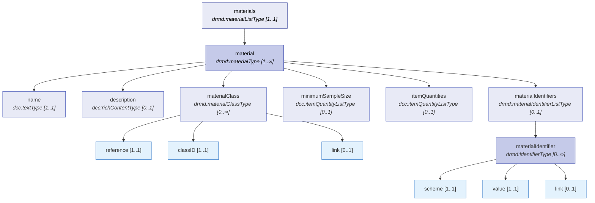
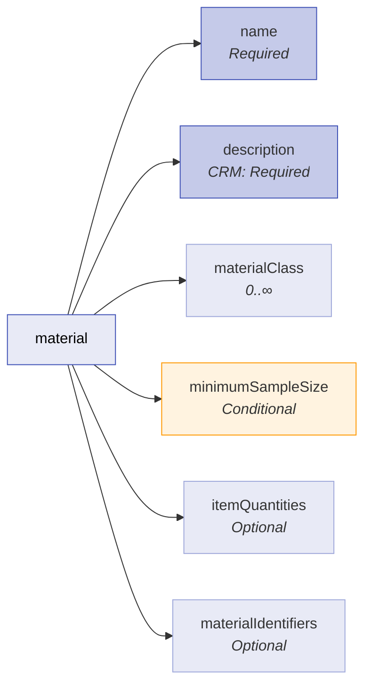
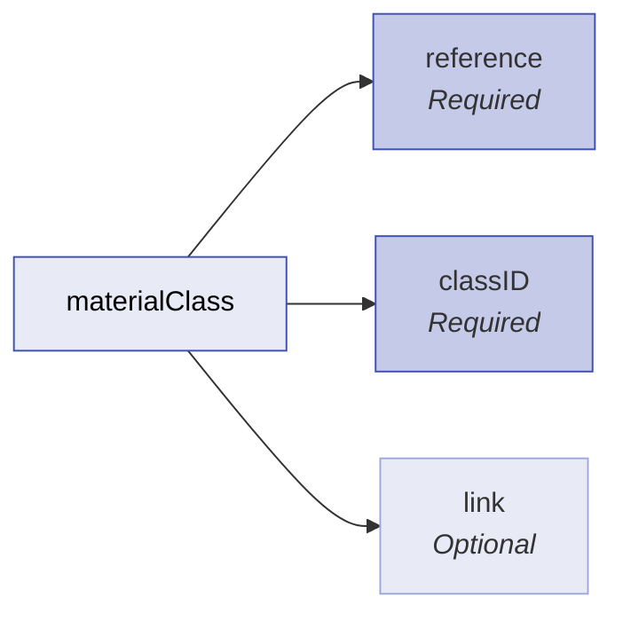
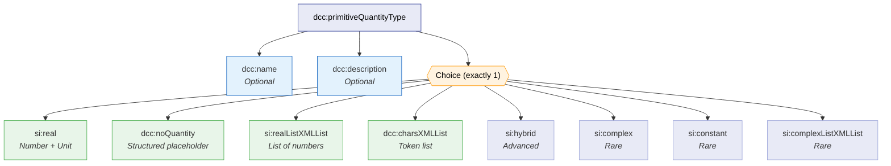
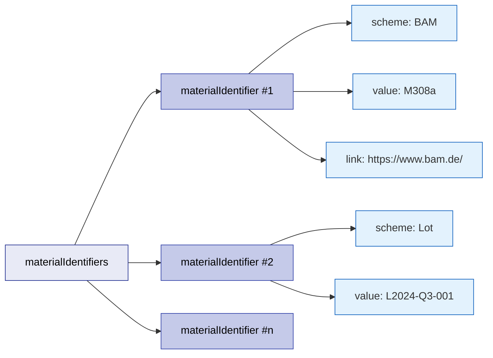
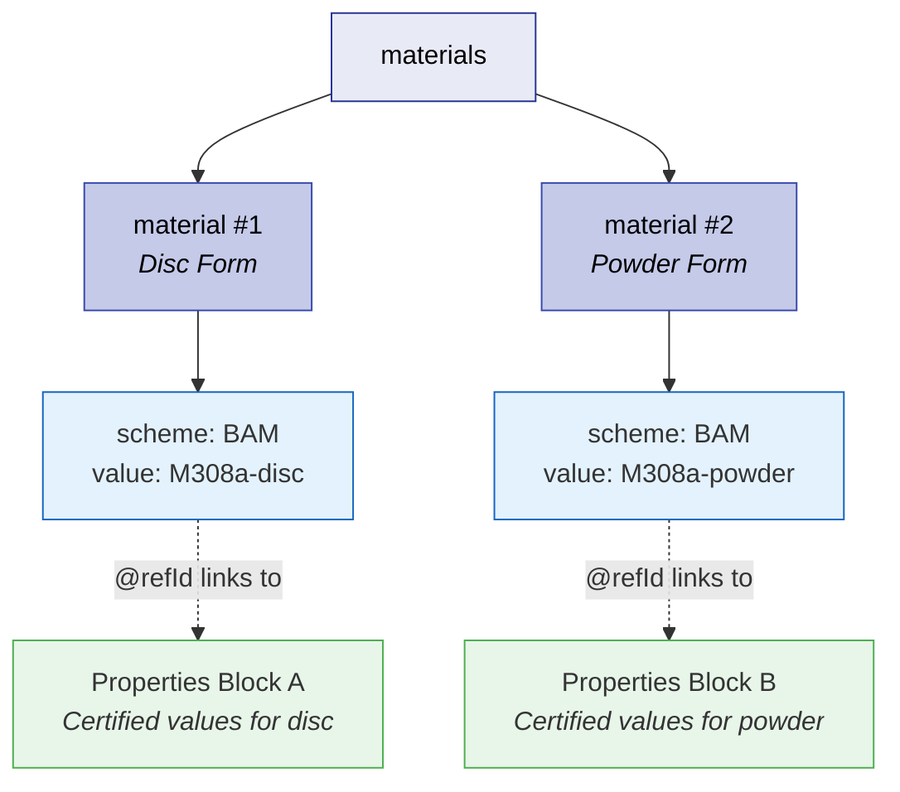
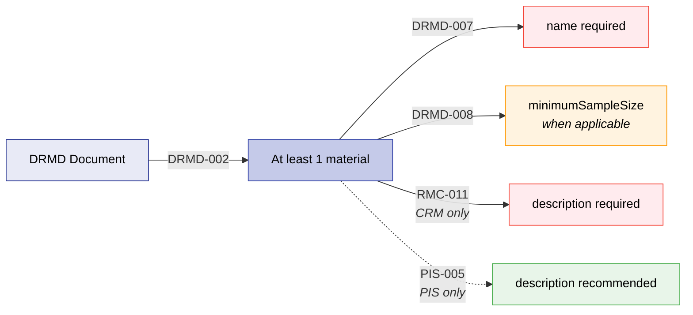

# Materials

The **Materials** block (`materials`) is the authoritative catalogue of the physical reference material(s) that a DRMD document describes. It answers, in a machine-readable way:

- **What** material(s) exist in this document (names, descriptions).
- **How** they are classified (optional, repeatable material classes).
- **How** they are identified externally (IDs such as BAM/CRM code, batch/lot, ROR, internal IDs).
- **What** sample amount(s) are relevant for using the material (e.g., minimum sample size; optional additional item quantities).

## Structure at a Glance



The six child elements of each `material` entry are:

| Child Element | Type | Required | Description |
|---------------|------|----------|-------------|
| **name** | `dcc:textType` | Mandatory | Human-readable product name |
| **description** | `dcc:richContentType` | CRM: Mandatory / ProductInformationSheet: Optional | Physical form, composition, matrix information |
| **materialClass** | `drmd:materialClassType` | Optional (repeatable) | Classification taxonomy assignment |
| **minimumSampleSize** | `dcc:itemQuantityListType` | Mandatory whenever applicable | Minimum quantity for valid use |
| **itemQuantities** | `dcc:itemQuantityListType` | Optional | Additional physical descriptors |
| **materialIdentifiers** | `drmd:materialIdentifierListType` | Optional | Canonical keys for matching/tracking |

!!! warning "Dual Validation Required"
    The DRMD schema uses a **dual-profile architecture**. The XSD defines the structure, but profile-specific mandatory requirements (e.g., `description` being mandatory for CRM documents) are enforced by the companion **Schematron business rules** (`drmd-business-rules.sch`). Full compliance requires passing **both** validations.

## 4.1 Purpose and Use

??? abstract "Who Uses This Block?"

    | Stakeholder | How They Use the Materials Block |
    |-------------|-------------------------------|
    | **Reference Material Producer (RMP)** | Publishes the canonical product identity (name + identifiers) and how to handle it (sample size). Ensures traceability between digital document and physical packaging/labels, catalog entries, and internal inventory systems. |
    | **Laboratories / End Users** | Know exactly which material the certified values apply to (especially crucial when there are multiple materials, lots, forms). Determine minimum sample size to plan method suitability, sample preparation, and replicate strategy. |
    | **Instrument / Machine Manufacturers** | Can ingest standardized material metadata to preconfigure methods. Map "material name/identifier" to internal instrument libraries. Display correct sample requirements and warnings in UI. |
    | **Software Developers / LIMS / ELN** | Use `materials/material/materialIdentifiers` to match DRMD content to database entities (product tables, lots, customer inventory). Use DCC quantity structures to reuse existing parsing/validation for numeric values and units. |
    | **Regulators / Auditors** | Verify the document refers to a clearly identified material, and the declared minimum sample size and identifiers are consistent with external references and packaging. |

!!! tip "Handling Multiple Materials"
    When a DRMD contains multiple `drmd:material` entries, the identifiers declared in `/drmd:materials/drmd:material/materialIdentifiers` should be treated as the **canonical keys** for linking downstream information. In the next chapter (Material Properties), software can use these material identifiers as stable references (e.g., via `@id`/`@refId` patterns) to associate each set of properties with the correct material.

## 4.2 Materials List

| Property | Value |
|----------|-------|
| **Element** | `drmd:materials` |
| **Path** | `/drmd:digitalReferenceMaterialDocument/drmd:materials` |
| **Type** | `drmd:materialListType` |
| **Cardinality** | **Required** `[1..1]` at root |
| **Contents** | One or more `drmd:material` |

**Purpose:** The top-level container that holds the catalogue of all physical reference materials covered by this DRMD document.

!!! tip "Best Practices"
    - Include **exactly one** `drmd:material` when the DRMD is for a single CRM/RM product.
    - Use **multiple** `drmd:material` entries when:
        - The DRMD certifies multiple distinct materials.
        - The product is a kit with distinct components.
        - Variants/forms are treated as separate "materials" with separate sample size constraints or identifiers.
    - Keep identifiers **stable across releases**; if you revise the document, avoid changing identifiers unless the material itself changes.

```xml
<drmd:materials>
  <drmd:material>
    <!-- ... material details ... -->
  </drmd:material>
</drmd:materials>
```

!!! danger "Schematron Rule: DRMD-002"
    Every DRMD document **MUST** contain at least one `material` entry in the materials catalogue (ISO 33401:2024, §5.2.4). Severity: **Error** — the document is non-compliant without at least one material.

## 4.3 Material Entry (`material`)

| Property | Value |
|----------|-------|
| **Element** | `drmd:material` |
| **Path** | `/drmd:digitalReferenceMaterialDocument/drmd:materials/drmd:material` |
| **Type** | `drmd:materialType` |
| **Cardinality** | `[1..∞]` within `drmd:materials` |

**Purpose:** Each `material` element represents a single physical reference material. It encapsulates everything needed to identify, describe, classify, and quantify the material.



### 4.3.1 Name (`name`)

| Property | Value |
|----------|-------|
| **Path** | `.../drmd:material/drmd:name` |
| **Type** | `dcc:textType` |
| **Cardinality** | **Required** `[1..1]` |

**Purpose:** The human-readable primary name of the material (e.g., "BAM-M308a", "AlZnMgCu1.5", "CRM XYZ-123").

??? abstract "Who Uses This Element?"

    | Stakeholder | How They Use It |
    |-------------|-----------------|
    | **Producer** | Public-facing product name |
    | **Lab** | Selection of correct material in procedures and reports |
    | **Software** | Display label and user selection (not a stable key — use identifiers for matching) |

!!! tip "Best Practices"
    - Provide at least one `dcc:content`.
    - If multilingual usage is expected, include multiple `dcc:content` entries with `@lang`.
    - Keep naming consistent with packaging/catalog.
    - Keep the "material name" short; put extended marketing/narrative into `drmd:description`.

```xml
<drmd:name>
  <dcc:content lang="en">Aluminium Alloy Disk</dcc:content>
  <dcc:content lang="de">Aluminiumscheibe (Legierung)</dcc:content>
</drmd:name>
```

!!! danger "Schematron Rule: DRMD-007"
    Every material entry **MUST** include a `name` element (ISO 33401:2024, §5.2.4). Severity: **Error**.

### 4.3.2 Description (`description`)

| Property | Value |
|----------|-------|
| **Path** | `.../drmd:material/drmd:description` |
| **Type** | `dcc:richContentType` |
| **Cardinality** | CRM: **Mandatory** / ProductInformationSheet: **Optional** `[0..1]` |

**Purpose:** Structured descriptive content including narrative text, attachments, and formulas. Typically used for form factor, composition notes, packaging form, and hazards summary pointers.

!!! tip "Best Practices"
    - Use description to capture: physical form, dimensions, matrix, appearance, preparation hints.
    - Keep long legal/health & safety statements in `drmd:statements` (not here), but you may reference them.
    - Use `dcc:content` for narrative.
    - Use `dcc:file` for images/spec sheets only when needed (otherwise keep DRMD lean).
    - Keep units/numerical constraints in `itemQuantities` or results sections rather than burying them only in narrative text.

=== "Text-only Example"

    ```xml
    <drmd:description>
      <dcc:name>
        <dcc:content lang="en">Material description</dcc:content>
      </dcc:name>
      <dcc:content lang="en">
        The reference material is provided as discs
        (approx. 65 mm diameter, 30 mm height).
        Intended for establishing/checking calibration
        of spark OES and XRF methods for similar matrices.
      </dcc:content>
    </drmd:description>
    ```

=== "With Attachment"

    ```xml
    <drmd:description>
      <dcc:content lang="en">See the attached technical drawing
        for geometry and tolerances.</dcc:content>
      <dcc:file>
        <dcc:fileName>BAM-M308a-drawing.pdf</dcc:fileName>
        <dcc:mimeType>application/pdf</dcc:mimeType>
        <dcc:dataBase64>BASE64_PDF_BYTES_HERE==</dcc:dataBase64>
      </dcc:file>
    </drmd:description>
    ```

!!! danger "Schematron Rule: RMC-011"
    Reference Material Certificates **MUST** include a description for each material (ISO 33401:2024, §5.3.2). Severity: **Error**. This rule does **not** apply to `productInformationSheet` documents, but a description is still recommended (PIS-005, Severity: **Warning**).

## 4.4 Material Classification (`materialClass`)

| Property | Value |
|----------|-------|
| **Path** | `.../drmd:material/drmd:materialClass` |
| **Type** | `drmd:materialClassType` |
| **Cardinality** | **Optional**, repeatable `[0..∞]` |

**Purpose:** A classification entry that ties the material to a classification scheme and a class identifier within that scheme.



| Child Element | Type | Required | Description |
|---------------|------|----------|-------------|
| **reference** | `dcc:notEmptyStringType` | Yes | Names the classification scheme (e.g., ISO, UNS, InternalCatalog, ECHA) |
| **classID** | `dcc:notEmptyStringType` | Yes | The code within that scheme |
| **link** | `xs:anyURI` | No | A resolvable URL to the scheme definition |

**Technical Attributes:** `@id` (xs:ID), `@refId` (xs:IDREFS), `@refType` (drmd:refTypesType) — all optional.

??? abstract "Who Uses This Element?"

    | Stakeholder | How They Use It |
    |-------------|-----------------|
    | **Producer** | Align product with internal classification or external taxonomy |
    | **Labs** | Group/filter materials by matrix/type (e.g., alloy class, soil class) |
    | **Manufacturers/Software** | Enable automated method suggestions or UI filters by class |

!!! tip "Best Practices"
    - Use `reference` for the scheme name (e.g., ISO, UNS, InternalCatalog, ECHA).
    - Use `classID` for the scheme's code.
    - Provide `link` when the scheme/class is resolvable online.

```xml
<drmd:materialClass id="mc-1">
  <drmd:reference>ISO 12103-1</drmd:reference>
  <drmd:classID>A2 Fine Test Dust</drmd:classID>
  <drmd:link>https://www.iso.org/standard/30109.html</drmd:link>
</drmd:materialClass>
```

## 4.5 Sample Size and Quantities

### 4.5.1 Minimum Sample Size (`minimumSampleSize`)

| Property | Value |
|----------|-------|
| **Path** | `.../drmd:material/drmd:minimumSampleSize` |
| **Type** | `dcc:itemQuantityListType` |
| **Cardinality** | **Mandatory whenever applicable** `[0..1]` |

**Purpose:** The minimum quantity of sample needed to use the material as intended. Often depends on the method family; if so, use multiple `dcc:itemQuantity` entries with names/descriptions inside the quantity structure.

??? abstract "Who Uses This Element?"

    | Stakeholder | How They Use It |
    |-------------|-----------------|
    | **Labs** | Compliance with certified use conditions; planning sample prep |
    | **Producer** | Communicate minimum amount for valid use |
    | **Software / Instruments** | Warnings if planned sample mass/volume is below minimum |

!!! tip "Best Practices"
    - Use `si:real` for numeric sample size + unit (e.g., 0.2 g).
    - If multiple minima exist (e.g., OES vs wet chemistry), provide multiple `dcc:itemQuantity` entries and differentiate using the quantity's name/description.

=== "Simple Minimum Sample Mass"

    ```xml
    <drmd:minimumSampleSize>
      <dcc:itemQuantity>
        <si:real>
          <si:label>Minimum sample mass for wet chemical analysis</si:label>
          <si:value>0.2</si:value>
          <si:unit>\gram</si:unit>
        </si:real>
      </dcc:itemQuantity>
    </drmd:minimumSampleSize>
    ```

=== "With Uncertainty"

    ```xml
    <drmd:minimumSampleSize>
      <dcc:itemQuantity>
        <si:real>
          <si:label>Minimum sample mass</si:label>
          <si:value>0.200</si:value>
          <si:unit>\gram</si:unit>
          <si:measurementUncertaintyUnivariate>
            <si:expandedMU>
              <si:valueExpandedMU>0.005</si:valueExpandedMU>
              <si:coverageFactor>2</si:coverageFactor>
              <si:coverageProbability>0.95</si:coverageProbability>
              <si:distribution>normal</si:distribution>
            </si:expandedMU>
          </si:measurementUncertaintyUnivariate>
        </si:real>
      </dcc:itemQuantity>
    </drmd:minimumSampleSize>
    ```

!!! danger "Schematron Rule: DRMD-008"
    Each material entry **MUST** specify a `minimumSampleSize` whenever applicable to ensure representative sampling for homogeneity (ISO 33401:2024, §5.2.7). Severity: **Conditional Error** — absence may be valid if not applicable to the specific material, but absence of this field when a minimum sample size exists constitutes a violation.

### 4.5.2 Item Quantities (`itemQuantities`)

| Property | Value |
|----------|-------|
| **Path** | `.../drmd:material/drmd:itemQuantities` |
| **Type** | `dcc:itemQuantityListType` |
| **Cardinality** | **Optional** `[0..1]` |

**Purpose:** Additional quantities describing the material item (not necessarily "minimum"), such as nominal item mass, dimensions (diameter/height), number of units in package, or storage temperature limits.

!!! tip "Best Practices"
    - Use this for quantitative descriptors of the material item/package.
    - Avoid duplicating general statements that belong in `drmd:statements`.

=== "Dimensions + Mass"

    ```xml
    <drmd:itemQuantities>
      <dcc:itemQuantity>
        <si:real>
          <si:label>Diameter</si:label>
          <si:value>65</si:value>
          <si:unit>mm</si:unit>
        </si:real>
      </dcc:itemQuantity>
      <dcc:itemQuantity>
        <si:real>
          <si:label>Height</si:label>
          <si:value>30</si:value>
          <si:unit>mm</si:unit>
        </si:real>
      </dcc:itemQuantity>
      <dcc:itemQuantity>
        <si:real>
          <si:label>Approximate mass</si:label>
          <si:value>250</si:value>
          <si:unit>\gram</si:unit>
        </si:real>
      </dcc:itemQuantity>
    </drmd:itemQuantities>
    ```

=== "Non-numeric Quantity"

    ```xml
    <drmd:itemQuantities>
      <dcc:itemQuantity>
        <dcc:noQuantity>
          <dcc:content lang="en">Item quantity not specified
            (varies by batch/packaging).</dcc:content>
        </dcc:noQuantity>
      </dcc:itemQuantity>
    </drmd:itemQuantities>
    ```

## 4.6 Primitive Quantity Type (Deep Dive)

The `dcc:primitiveQuantityType` is the foundational container for every single quantitative statement in a DRMD. It is used inside both `minimumSampleSize` and `itemQuantities`. Understanding its structure is key to producing valid, interoperable data.



!!! tip "Best Practices"
    - Provide `dcc:name` whenever a list contains multiple quantities (humans and software need labels).
    - **Default to Option A** (`si:real`) for numeric + unit (highest interoperability).
    - Use Option C (`si:realListXMLList`) only when your ecosystem supports list parsing; otherwise model multiple `dcc:itemQuantity` entries each with `si:real`.
    - Use Option B (`dcc:noQuantity`) only when numeric is truly not applicable.
    - Use `dcc:charsXMLList` for controlled vocabulary / token lists — not for numbers.
    - Treat `si:hybrid`, `si:complex`, `si:constant`, `si:complexListXMLList` as advanced/rare options.

### 4.6.1 Option A — `si:real`

Use when you have **one number with one unit**. This is the most common and interoperable option.

```xml
<dcc:itemQuantity>
  <dcc:name><dcc:content lang="en">Minimum sample size</dcc:content></dcc:name>
  <si:real>
    <si:value>0.2</si:value>
    <si:unit>g</si:unit>
  </si:real>
</dcc:itemQuantity>
```

### 4.6.2 Option B — `dcc:noQuantity`

Use when the value is **intentionally not numeric**, but you want a structured placeholder and explanation.

```xml
<dcc:itemQuantity>
  <dcc:name><dcc:content lang="en">Minimum sample size</dcc:content></dcc:name>
  <dcc:noQuantity>
    <dcc:content lang="en">Not specified; depends on method.</dcc:content>
  </dcc:noQuantity>
</dcc:itemQuantity>
```

### 4.6.3 Option C — `si:realListXMLList`

Use when one "quantity" is naturally a **list of numbers**, each paired with a unit entry.

```xml
<dcc:itemQuantity>
  <dcc:name><dcc:content lang="en">Recommended test portions</dcc:content></dcc:name>
  <si:realListXMLList>
    <si:valueXMLList>0.1</si:valueXMLList>
    <si:valueXMLList>0.2</si:valueXMLList>
    <si:unitXMLList>g</si:unitXMLList>
    <si:unitXMLList>g</si:unitXMLList>
  </si:realListXMLList>
</dcc:itemQuantity>
```

### 4.6.4 Option D — `dcc:charsXMLList`

Use when the "quantity" is best represented as a **list of tokens/strings** (not numeric), e.g., categorical values, codes, labels.

```xml
<dcc:itemQuantity>
  <dcc:name><dcc:content lang="en">Applicable methods</dcc:content></dcc:name>
  <dcc:charsXMLList>ICP-OES XRF OES</dcc:charsXMLList>
</dcc:itemQuantity>
```

### 4.6.5 Options E–H (Advanced/Rare)

These options exist for specialized use cases:

| Option | Element | When to Use |
|--------|---------|-------------|
| **E** | `si:hybrid` | When you need a hybrid representation, typically when a plain double is insufficient |
| **F** | `si:complex` | When the quantity is genuinely complex-valued (real + imaginary) |
| **G** | `si:constant` | When you need to represent a constant quantity as defined by the SI schema |
| **H** | `si:complexListXMLList` | When you need a list of complex numbers in compact list form |

## 4.7 Material Identifiers

Material Identifiers provide the canonical, **machine-actionable keys** to uniquely (or strongly) identify a reference material across producers, lots/batches, catalogs, and downstream systems. Unlike free-text names, identifiers are intended to be **stable** and suitable for indexing, deduplication, traceability, and cross-document linking.



### 4.7.1 Material Identifiers List

| Property | Value |
|----------|-------|
| **Path** | `.../drmd:material/materialIdentifiers` |
| **Type** | `drmd:materialIdentifierListType` |
| **Cardinality** | **Optional** `[0..1]` |

!!! tip "Best Practices"
    - Provide this list whenever the material must be uniquely tracked (almost always recommended).
    - Include at least one **product-level identifier** (e.g., catalog/material code) and one **lot/batch-level identifier** when the DRMD is specific to a batch/production run.
    - Keep identifiers exactly as printed on packaging/certificate (case, punctuation, separators).
    - Prefer persistent/resolvable identifier schemes (DOI, Handle, official producer page) whenever possible.

### 4.7.2 Material Identifier Entry

| Property | Value |
|----------|-------|
| **Path** | `.../materialIdentifiers/drmd:materialIdentifier` |
| **Type** | `drmd:identifierType` |
| **Cardinality** | `[0..∞]` within the list |

Each `drmd:materialIdentifier` is one identifier instance, expressed as a **scheme + value** pair, optionally with a link.

| Child Element | Type | Required | Description |
|---------------|------|----------|-------------|
| **scheme** | `dcc:notEmptyStringType` | Yes | Names the identifier system / namespace / issuing authority |
| **value** | `dcc:notEmptyStringType` | Yes | The identifier string itself |
| **link** | `xs:anyURI` | No | A resolvable URL for the identifier |

!!! note "Recommended Scheme Values"
    Use a controlled set of scheme names across your organization to avoid duplicates:

    | Scheme | Category | Example Value |
    |--------|----------|---------------|
    | `BAM`, `NIST`, `ERM`, `LGC` | Producer-specific | `M308a`, `SRM-610` |
    | `ERP`, `SAP`, `InternalMaterialID` | Internal enterprise | `MAT-2024-001` |
    | `CatalogNo`, `GTIN` | Commercial | `7640114565019` |
    | `Lot`, `Batch` | Batch identifiers | `L2024-Q3-001` |
    | `DOI`, `Handle`, `URL` | Persistent identifiers | `10.1234/bam-m308a` |

### 4.7.3 Attributes

These attributes exist on each `drmd:materialIdentifier` and are useful for internal cross-references, merges, and structured linking patterns.

| Attribute | Type | Description |
|-----------|------|-------------|
| `@id` | `xs:ID` | Defines an internal XML identifier for this node. Use when you want to reference this exact element via `@refId` or want stable anchors for processing pipelines. |
| `@refId` | `xs:IDREFS` | One or more references to `@id` values elsewhere in the document. Supports internal linking such as mapping identifiers or connecting imported/legacy IDs to canonical ones. |
| `@refType` | `drmd:refTypesType` | Classifies the purpose/type of the reference. Enumeration values: `basic_certificateIdentification`, `basic_measuredValue`. Use only when you have a clear internal convention. |

### 4.7.4 Multi-Material Scenario

When a DRMD contains **multiple `drmd:material` entries** (e.g., different lots, different physical forms), the identifiers declared under `/drmd:materials/drmd:material/materialIdentifiers` should be treated as the canonical keys for linking downstream information.



!!! tip "Implementation Options"
    - **XML-native approach:** Assign `@id` on a chosen identifier element and reference it using `@refId` patterns where the schema permits.
    - **Database approach:** Map `(scheme, value)` pairs into normalized keys and use them as foreign keys across imported DRMD content.

???+ example "Complete Material Identifier Example"

    ```xml
    <drmd:materialIdentifiers>
      <drmd:materialIdentifier id="matid_m308a"
          refId="mat_001" refType="basic_certificateIdentification">
        <drmd:scheme>BAM</drmd:scheme>
        <drmd:value>M308a</drmd:value>
        <drmd:link>https://www.bam.de/</drmd:link>
      </drmd:materialIdentifier>
    </drmd:materialIdentifiers>
    ```

## Business Rules Summary

The following Schematron rules directly govern the Materials section:

| Rule ID | Scope | Severity | Description |
|---------|-------|----------|-------------|
| **DRMD-002** | All documents | Error | Every DRMD **MUST** contain at least one `material` entry (ISO 33401:2024, §5.2.4) |
| **DRMD-007** | All documents | Error | Every `material` entry **MUST** include a `name` element (ISO 33401:2024, §5.2.4) |
| **DRMD-008** | All documents | Conditional Error | Each `material` **MUST** specify `minimumSampleSize` whenever applicable (ISO 33401:2024, §5.2.7) |
| **RMC-011** | CRM only | Error | Reference Material Certificates **MUST** include a `description` for each material (ISO 33401:2024, §5.3.2) |
| **PIS-005** | ProductInformationSheet only | Warning | Product Information Sheets **SHOULD** include a `description` for each material |



## Complete Material Example

??? example "Full materials Block (Click to Expand)"

    ```xml
    <drmd:materials>
      <drmd:material>
        <!-- Name (required) -->
        <drmd:name>
          <dcc:content lang="en">Aluminium Alloy Disk BAM-M308a</dcc:content>
          <dcc:content lang="de">Aluminiumlegierung Scheibe BAM-M308a</dcc:content>
        </drmd:name>

        <!-- Description (mandatory for CRM) -->
        <drmd:description>
          <dcc:name>
            <dcc:content lang="en">Material description</dcc:content>
          </dcc:name>
          <dcc:content lang="en">
            The reference material is provided as discs
            (approx. 65 mm diameter, 30 mm height).
            Intended for establishing/checking calibration
            of spark OES and XRF methods for similar matrices.
          </dcc:content>
        </drmd:description>

        <!-- Classification (optional, repeatable) -->
        <drmd:materialClass id="mc-1">
          <drmd:reference>ISO 12103-1</drmd:reference>
          <drmd:classID>A2 Fine Test Dust</drmd:classID>
          <drmd:link>https://www.iso.org/standard/30109.html</drmd:link>
        </drmd:materialClass>

        <!-- Minimum Sample Size (mandatory whenever applicable) -->
        <drmd:minimumSampleSize>
          <dcc:itemQuantity>
            <si:real>
              <si:label>Minimum sample mass for wet chemical analysis</si:label>
              <si:value>0.2</si:value>
              <si:unit>\gram</si:unit>
            </si:real>
          </dcc:itemQuantity>
        </drmd:minimumSampleSize>

        <!-- Item Quantities (optional) -->
        <drmd:itemQuantities>
          <dcc:itemQuantity>
            <si:real>
              <si:label>Diameter</si:label>
              <si:value>65</si:value>
              <si:unit>mm</si:unit>
            </si:real>
          </dcc:itemQuantity>
          <dcc:itemQuantity>
            <si:real>
              <si:label>Height</si:label>
              <si:value>30</si:value>
              <si:unit>mm</si:unit>
            </si:real>
          </dcc:itemQuantity>
          <dcc:itemQuantity>
            <si:real>
              <si:label>Approximate mass</si:label>
              <si:value>250</si:value>
              <si:unit>\gram</si:unit>
            </si:real>
          </dcc:itemQuantity>
        </drmd:itemQuantities>

        <!-- Material Identifiers (optional) -->
        <drmd:materialIdentifiers>
          <drmd:materialIdentifier id="matid_m308a"
              refId="mat_001"
              refType="basic_certificateIdentification">
            <drmd:scheme>BAM</drmd:scheme>
            <drmd:value>M308a</drmd:value>
            <drmd:link>https://www.bam.de/</drmd:link>
          </drmd:materialIdentifier>
          <drmd:materialIdentifier>
            <drmd:scheme>Lot</drmd:scheme>
            <drmd:value>L2024-Q3-001</drmd:value>
          </drmd:materialIdentifier>
        </drmd:materialIdentifiers>
      </drmd:material>
    </drmd:materials>
    ```
