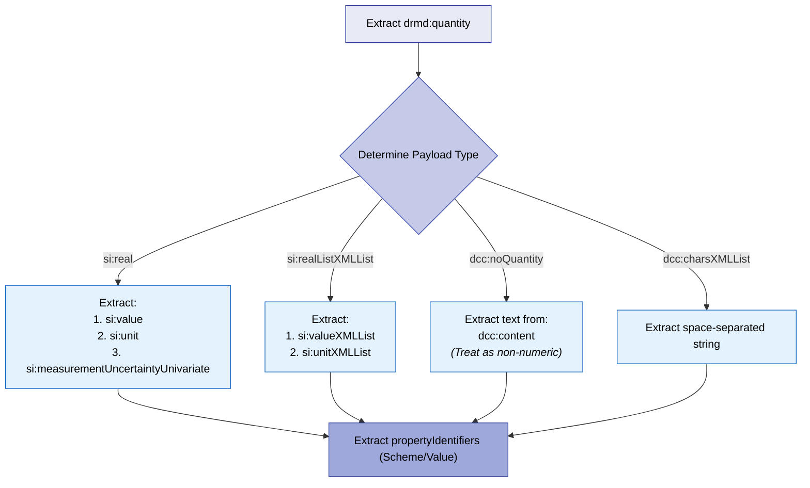
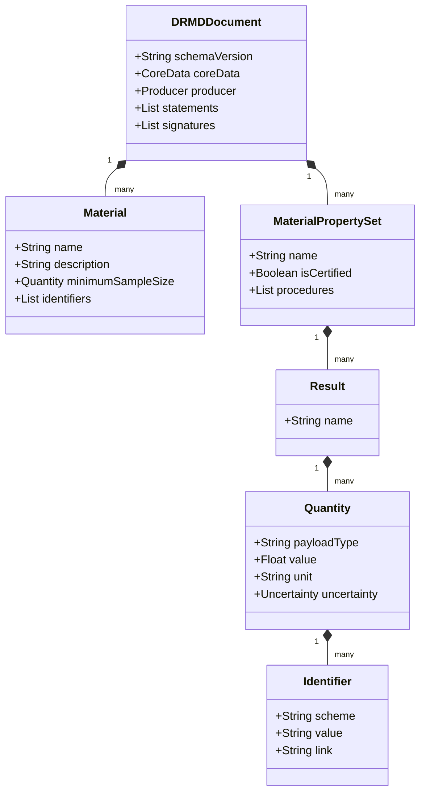

# Parsing & Data Extraction Guide

This chapter provides implementation guidance for software developers—such as those building LIMS (Laboratory Information Management Systems), ELNs (Electronic Lab Notebooks), or analytical instrument software—to reliably parse DRMD documents and extract data for automated workflows.

Because the DRMD schema is built upon DCC and SI namespaces, and supports multilingual text and optional attachments, a robust parser must be designed to handle these variables gracefully.

---

## 13.1 Namespace Handling & Parser Configuration

### 13.1.1 Prefix-Independence (Critical)
XML prefixes are not significant and can change depending on how the document was generated. **Your code MUST match elements by Namespace URI + Local Name, never by prefix string.**

| Namespace | Recommended URI |
|-----------|-----------------|
| **DRMD** | `https://example.org/drmd` |
| **DCC** | `https://ptb.de/dcc` |
| **SI** | `https://ptb.de/si` |
| **XMLDSig**| `http://www.w3.org/2000/09/xmldsig#` |

### 13.1.2 Recommended Parser Configuration
- Use a fully namespace-aware XML parser.
- **Disable external entity resolution** (XXE protection) to ensure security.
- If performing structural validation, resolve schema imports from trusted offline bundles rather than external URLs.

---

## 13.2 Data Normalization Strategies

### 13.2.1 Multilingual Text Fallback (`dcc:textType`)
Many strings appear as `dcc:content` with an optional `@lang` attribute (ISO 639-1). Implement the following fallback algorithm for UI display:

1. If the application requests a specific language (e.g., `en`), select all `dcc:content[@lang='en']`.
2. If none match, look for `dcc:content` elements without a `@lang` attribute (treat as default).
3. If still none match, use the very first available `dcc:content` block regardless of language.

### 13.2.2 Identifier Normalization
When extracting `(scheme, value)` identifier pairs:
- Trim all whitespace.
- Normalize the `scheme` spelling (e.g., lowercasing).
- **Keep raw values unchanged** (as some identifier values are case-sensitive).

### 13.2.3 Numeric Precision
Store extracted values as high-precision numeric types (double or decimal). **Do not round values upon import.** Preserve the original lexical form to ensure round-trip integrity, and apply rounding logic only at the UI/display layer.

---

## 13.3 The Quantity Extraction Algorithm

The `drmd:quantity` element can carry its payload in several different XML types. A robust parser should implement a unified algorithm to extract the value, unit, and uncertainty based on the provided choice.

!!! tip "Getting Certified Values"
    To query for certified values, filter your XPath to only include quantities descending from:
    `/drmd:digitalReferenceMaterialDocument/drmd:materialPropertiesList/drmd:materialProperties[@isCertified='true']`

---

## 13.4 Recommended Internal Object Model

When parsing the DRMD XML into your software's backend, it is highly recommended to map the XML structure into a simplified internal object model consisting of a few core entities.

