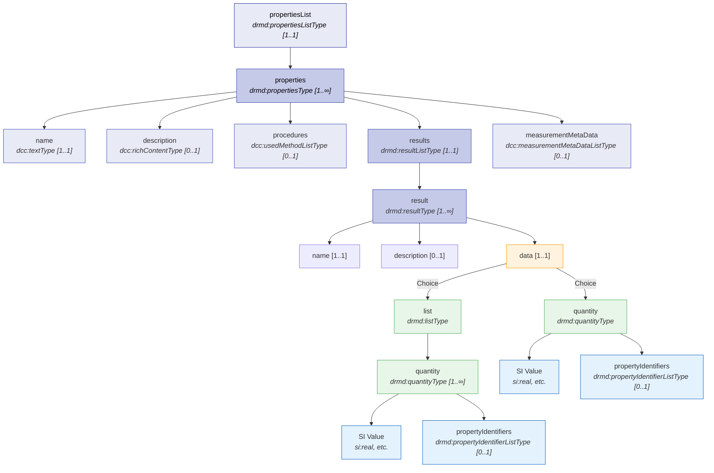
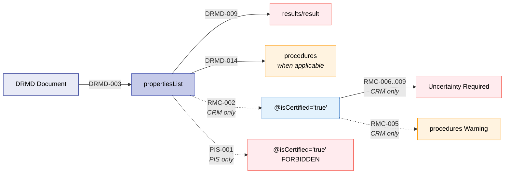

# Properties

The **Properties** block (`propertiesList`, previously known as `materialPropertiesList`) is the core metrological repository structuring certified and informational measurement data tables, uncertainties, D-SI units, and substance mapping keys. 

It provides the structured, machine-readable representation of:

- Certified and non-certified (informative) property sets (distinguished by the `@isCertified` attribute).
- Results grouped into logical sections (e.g., *Mass fraction*, *Density*, *Sputter factor*).
- Numeric values with units and uncertainties using the SI (D-SI) structures (e.g., `si:real`, `si:realListXMLList`).
- Property identifiers for each quantity (`propertyIdentifiers`) so software can reliably interpret what a value refers to (e.g., element/compound/property codes).
- Procedures (methods) and measurement metadata that provide provenance and interpretation context (method references, traceability statements, conventions, validity notes, responsible authority, etc.).

## Structure at a Glance



!!! warning "Dual Validation Required"
    The DRMD schema relies on a dual-profile architecture. The XSD defines the structure, but profile-specific mandatory requirements (e.g., the presence of `@isCertified="true"`, or mandatory uncertainties for certified values) are enforced by the companion **Schematron business rules** (`drmd-business-rules.sch`).

---

## 5.1 Purpose and Use

| Stakeholder | How They Use the Properties Block |
|-------------|-----------------------------------|
| **Reference Material Producer (RMP)** | Publishes the authoritative dataset of certified values and clearly separates informative values. Provides transparency (uncertainty conventions, measurement procedures, metadata needed for audits). |
| **Laboratories / End Users** | Retrieve the correct values for their intended use (certified vs informative). Understand uncertainty meaning (coverage factor/probability) and measurement context needed for correct reporting. Use property identifiers to avoid ambiguity. |
| **Instrument / Machine Manufacturers** | Ingest property tables for calibration/verification workflows and instrument libraries. Use units and uncertainties for automated validation, warnings, and calculation logic. |
| **Software Developers / LIMS / ELN** | Parse results into structured records and map quantities to analytes using `propertyIdentifiers`. Use `@id`/`@refId` conventions to link property blocks to the correct material definition when multiple materials exist. Filter datasets by `@isCertified`. |
| **Regulators / Auditors** | Verify that certified values are clearly distinguished from informative values. Confirm that measurement provenance, conventions, and traceability statements are recorded in a structured form. |

---

## 5.2 Properties List (`propertiesList`)

| Property | Value |
|----------|-------|
| **Element** | `drmd:propertiesList` |
| **Path** | `/drmd:digitalReferenceMaterialDocument/drmd:propertiesList` |
| **Type** | `drmd:propertiesListType` |
| **Cardinality** | **Required** `[1..1]` at root |
| **Contents** | One or more `drmd:properties` |

**Purpose:** A required top-level list of property blocks, each bundling semantic titles, context, procedures, results, and measurement metadata.

!!! tip "Best Practices"
    - Use multiple `drmd:properties` blocks to separate:
        - Certified vs informative values (using `@isCertified`).
        - Different analytical methods.
        - Different property families (composition vs density vs sputter factors).
    - Assign `@id` to each block for deterministic references.

```xml
<drmd:propertiesList>
  <drmd:properties>...</drmd:properties>
  <drmd:properties>...</drmd:properties>
</drmd:propertiesList>
```

---

## 5.3 Properties Block (`properties`)

| Property | Value |
|----------|-------|
| **Element** | `drmd:properties` |
| **Path** | `.../drmd:propertiesList/drmd:properties` |
| **Type** | `drmd:propertiesType` |
| **Cardinality** | `[1..∞]` within `drmd:propertiesList` |

The `properties` block acts as a "chapter subsection" that groups results into a coherent dataset (e.g., "Certified values", "Informative values").

### 5.3.1 Child Elements

| Child Element | Type | Required | Description |
|---------------|------|----------|-------------|
| **name** | `dcc:textType` | Yes | The descriptive title of the characterization section |
| **description** | `dcc:richContentType` | No | Global contextual definitions applying broadly across nested measurements |
| **procedures** | `dcc:usedMethodListType` | Conditional | Laboratory methods, hardware systems. Mandatory when applicable (DRMD-014) |
| **results** | `drmd:resultListType` | Yes | The structured measurement value tables |
| **measurementMetaData** | `dcc:measurementMetaDataListType`| No | Metadata formalizing institutional confidence, valid periods, etc. |

### 5.3.2 Technical Attributes

| Attribute | Type | Description |
|-----------|------|-------------|
| `@id` | `xs:ID` | Internal anchor for cross-referencing |
| `@refId` | `xs:IDREFS` | Reference to another node (e.g., linking a property block to a specific material ID) |
| `@refType` | `drmd:refTypesType` | Enum classifying the reference type |
| **`@isCertified`**| `xs:boolean` | **Critical flag governing metrological automated ingestion policies.** |

!!! danger "Certification Rules (Schematron)"
    - **CRM Profile (`RMC-002`)**: At least one `properties` block **MUST** have `@isCertified="true"`.
    - **PIS Profile (`PIS-001`)**: No `properties` block may have `@isCertified="true"`.
    - Omitting the attribute entirely evaluates to `false` (informative).

```xml
<drmd:properties id="mp_certified" isCertified="true">
  <drmd:name>
    <dcc:content lang="en">Certified Values</dcc:content>
  </drmd:name>
  <drmd:description>
    <dcc:name><dcc:content lang="en">Uncertainty convention</dcc:content></dcc:name>
    <dcc:content lang="en">U is the estimated expanded uncertainty with coverage factor k=2 (~95%).</dcc:content>
  </drmd:description>
  <!-- ... procedures, results, metadata ... -->
</drmd:properties>
```

---

## 5.4 Results List (`results`)

| Property | Value |
|----------|-------|
| **Path** | `.../drmd:properties/drmd:results` |
| **Type** | `drmd:resultListType` |
| **Cardinality** | **Required** `[1..1]` inside properties |

**Purpose:** A required list of results in this dataset. It allows the producer to define multiple result sections like "Mass fraction", "Density", "Sputter factor". Software renders each result as a separate section or table.

!!! danger "Schematron Rule: DRMD-009"
    Each `properties` block **MUST** contain at least one `result` inside `results`.

```xml
<drmd:results>
  <drmd:result>...</drmd:result>
  <drmd:result>...</drmd:result>
</drmd:results>
```

---

## 5.5 Result Type (`result`)

| Property | Value |
|----------|-------|
| **Path** | `.../drmd:results/drmd:result` |
| **Type** | `drmd:resultType` |
| **Cardinality** | `[1..∞]` inside results |

A named result container. 

| Child Element | Type | Required | Description |
|---------------|------|----------|-------------|
| **name** | `dcc:textType` | Yes | Result section name (e.g., "Mass fraction") |
| **description** | `dcc:richContentType` | No | Specific context for this result |
| **data** | `drmd:dataType` | Yes | The actual numeric payload |

!!! tip "Best Practices"
    - Put shared wording (e.g., uncertainty definition) at the `properties` description level if it applies everywhere; only repeat here if it is result-specific.
    - Use `@refType="basic_measuredValue"` if you want to label results as measured values in a controlled way.

```xml
<drmd:result id="res_massFraction" refType="basic_measuredValue">
  <drmd:name>
    <dcc:content lang="en">Mass fraction</dcc:content>
  </drmd:name>
  <drmd:description>
    <dcc:content lang="en">Values are given as percent by mass.</dcc:content>
  </drmd:description>
  <drmd:data>...</drmd:data>
</drmd:result>
```

---

## 5.6 Data Type (`data`)

| Property | Value |
|----------|-------|
| **Path** | `.../drmd:result/drmd:data` |
| **Choice** | **Exactly one:** `drmd:list` OR `drmd:quantity` |
| **Cardinality** | **Required** `[1..1]` inside result |

An operational choice node regulating structural measurement representations.

- **`list`** (`drmd:listType`): Use for compositional tables (many elements, multi-row tables).
- **`quantity`** (`drmd:quantityType`): Use for single-value properties (e.g., density).

---

## 5.7 List Type (`list`)

| Property | Value |
|----------|-------|
| **Path** | `.../drmd:data/drmd:list` |
| **Type** | `drmd:listType` |
| **Contents** | `[1..∞]` `drmd:quantity` elements |

**Purpose:** A sequential index of repeating quantity rows. Serves as the structural framework for compositional tables where every unique analyte row encapsulates individual D-SI unit records, uncertainty fields, and identity codes.

```xml
<drmd:list>
  <drmd:quantity>...</drmd:quantity> <!-- e.g., Al -->
  <drmd:quantity>...</drmd:quantity> <!-- e.g., Fe -->
</drmd:list>
```

---

## 5.8 Quantity Type (`quantity`)

| Property | Value |
|----------|-------|
| **Path** | `.../drmd:data/drmd:quantity` OR `.../drmd:list/drmd:quantity` |
| **Type** | `drmd:quantityType` (extends `dcc:primitiveQuantityType`) |

This is the core measurement container. It inherits all properties of a DCC `primitiveQuantityType` and adds DRMD-specific property identifiers.

### 5.8.1 Structure

1. **`dcc:name`** (optional) - Label for the quantity (e.g., "Al").
2. **`dcc:description`** (optional) - Description (e.g., "Mass fraction of Aluminium").
3. **Value Choice (Exactly One)**:
    - `si:real`, `dcc:noQuantity`, `si:realListXMLList`, `dcc:charsXMLList`, `si:hybrid`, `si:complex`, `si:constant`, `si:complexListXMLList`.
4. **`drmd:propertyIdentifiers`** (optional) - Stable keys mapping the quantity to an analyte registry (e.g., CAS numbers).

!!! tip "Best Practices"
    - Use `si:real` for single values with unit.
    - Provide `drmd:propertyIdentifiers` for each analyte/property in tables for robust machine mapping.

### 5.8.2 Example: Quantity with SI and Identifier

```xml
<drmd:quantity id="q_al" refType="propertyRow">
  <dcc:name>
    <dcc:content lang="en">Al</dcc:content>
  </dcc:name>
  <dcc:description>
    <dcc:content lang="en">Mass fraction of Aluminium.</dcc:content>
  </dcc:description>
  <si:real>
    <si:label>mass fraction</si:label>
    <si:quantityTypeQUDT>MassFraction</si:quantityTypeQUDT>
    <si:value>49.5</si:value>
    <si:unit>\percent</si:unit>
    <si:measurementUncertaintyUnivariate>
      <si:expandedMU>
        <si:valueExpandedMU>1.3</si:valueExpandedMU>
        <si:coverageFactor>2</si:coverageFactor>
        <si:coverageProbability>0.95</si:coverageProbability>
        <si:distribution>normal</si:distribution>
      </si:expandedMU>
    </si:measurementUncertaintyUnivariate>
  </si:real>
  <drmd:propertyIdentifiers>
    <drmd:propertyIdentifier id="pid_al_cas" refType="basic_measuredValue">
      <drmd:scheme>CAS</drmd:scheme>
      <drmd:value>7429-90-5</drmd:value>
      <drmd:link>https://commonchemistry.cas.org/detail?cas_rn=7429-90-5</drmd:link>
    </drmd:propertyIdentifier>
  </drmd:propertyIdentifiers>
</drmd:quantity>
```

---

## 5.9 Property Identifiers (`propertyIdentifiers`)

| Property | Value |
|----------|-------|
| **Path** | `.../drmd:quantity/drmd:propertyIdentifiers` |
| **Type** | `drmd:propertyIdentifierListType` |
| **Cardinality** | **Optional** `[0..1]` |

A list of identifiers that identify what property this quantity represents (e.g., element, compound, property kind).

**Purpose:** Makes "Fe mass fraction" machine-readable, reducing ambiguity in multi-analyte tables and ensuring robust mapping to analyte registries.

| Child Element | Type | Required | Description |
|---------------|------|----------|-------------|
| **scheme** | `dcc:notEmptyStringType` | Yes | Naming authority (e.g., "CAS", "IUPAC") |
| **value** | `dcc:notEmptyStringType` | Yes | The code (e.g., "7439-89-6") |
| **link** | `xs:anyURI` | No | Web link to definition |

---

## 5.10 Procedures & Measurement Metadata

### 5.10.1 Procedures (`procedures`)

| Property | Value |
|----------|-------|
| **Path** | `.../drmd:properties/drmd:procedures` |
| **Type** | `dcc:usedMethodListType` |

Provides traceability and reproducibility of property assignment. 

!!! danger "Schematron Rule: DRMD-014"
    Procedures are **mandatory whenever applicable**. Rule `RMC-005` additionally provides a warning if procedures are omitted for certified property blocks.

```xml
<drmd:procedures>
  <dcc:usedMethod id="m1">
    <dcc:name><dcc:content lang="en">ICP-OES</dcc:content></dcc:name>
    <dcc:description>
      <dcc:content lang="en">Elemental analysis by inductively coupled plasma optical emission spectrometry.</dcc:content>
    </dcc:description>
    <dcc:norm>ISO 11885</dcc:norm>
    <dcc:link>https://www.iso.org/standard/56153.html</dcc:link>
  </dcc:usedMethod>
</drmd:procedures>
```

### 5.10.2 Measurement Metadata (`measurementMetaData`)

| Property | Value |
|----------|-------|
| **Path** | `.../drmd:properties/drmd:measurementMetaData` |
| **Type** | `dcc:measurementMetaDataListType` |

Attach structured declarations: traceability, conventions, validity. This allows labs to interpret confidence statements and software to enable filters like `traceable=true`.

---

## 5.11 Property Values from SI

### 5.11.1 `si:real`

The most common value type. Requires `value` (double) and `unit` (string). Can optionally include a `measurementUncertaintyUnivariate` block.

!!! danger "Uncertainty Rules (Schematron)"
    For any CRM document, if `@isCertified="true"`, the `si:real` payload **MUST** include uncertainty (`measurementUncertaintyUnivariate`, `expandedUnc`, or `coverageInterval`). This is enforced by Schematron rules `RMC-006` to `RMC-009`.

### 5.11.2 `si:realListXMLList`

Provides compact lists of numbers. Includes unbounded `valueXMLList` and `unitXMLList` elements.

```xml
<si:realListXMLList>
  <si:valueXMLList>0.81</si:valueXMLList>
  <si:valueXMLList>0.82</si:valueXMLList>
  <si:unitXMLList>\one</si:unitXMLList>
  <si:unitXMLList>\one</si:unitXMLList>
</si:realListXMLList>
```

---

## Business Rules Summary

The following Schematron rules govern the Properties section to ensure document integrity:

| Rule ID | Scope | Severity | Description |
|---------|-------|----------|-------------|
| **DRMD-003** | All documents | Error | Every DRMD MUST contain at least one `properties` block. |
| **DRMD-009** | All documents | Error | Each `properties` block MUST contain `results`. |
| **DRMD-014** | All documents | Conditional Error | Each `properties` block MUST include `procedures` whenever applicable. |
| **RMC-002** | CRM only | Error | At least one `properties` block MUST have `@isCertified="true"`. |
| **RMC-005** | CRM only | Warning | Certified `properties` SHOULD document measurement procedures. |
| **RMC-006 to 009** | CRM only | Error | All certified quantity payloads (`si:real`, `si:realListXMLList`, `si:hybrid`) MUST include uncertainty. |
| **PIS-001** | PIS only | Error | Product Information Sheets MUST NOT have `@isCertified="true"` on any `properties` block. |


