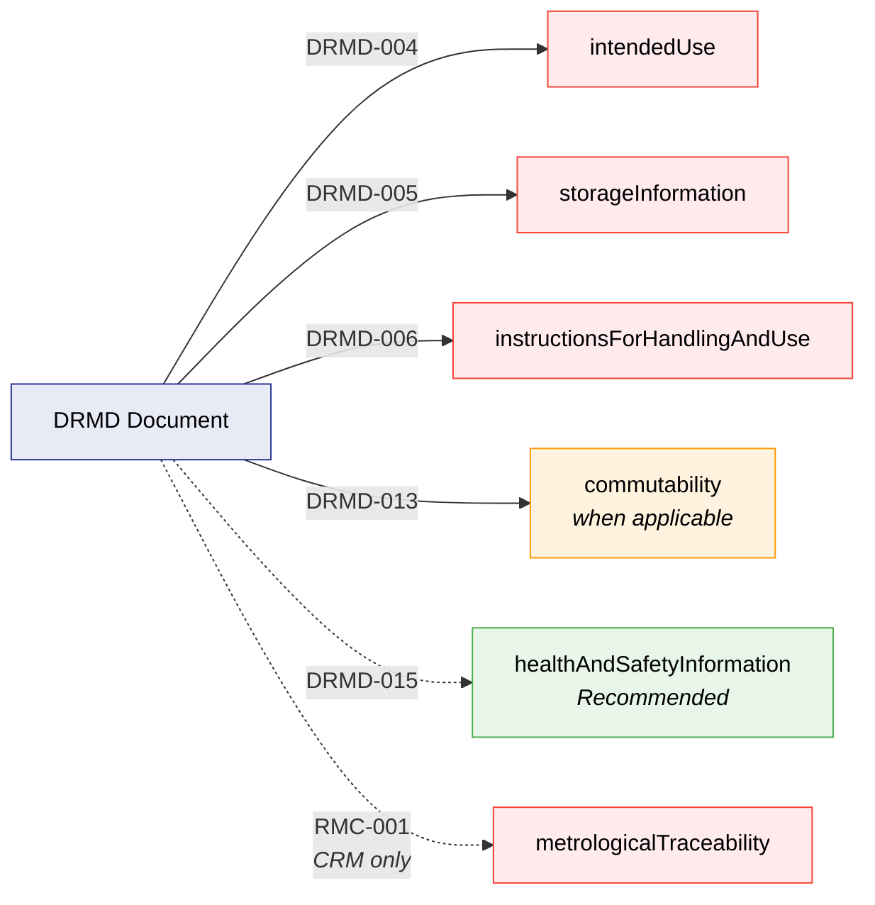

# Statements

The **Statements** block (`statements`) contains the human-readable declarations and guidance that accompany a reference material and its certified/informative values. It captures critical normative and operational details in a structured but narrative-friendly way.

All statement elements are typed as `dcc:richContentType`, allowing multilingual text and optional attachments (PDFs/images) and formulas.

## Structure at a Glance

The `statements` block enforces a **strict sequential order** of its child elements. The schema requires you to declare them exactly in the sequence shown below to comply with ISO 33401:2024 reporting guidelines.

```mermaid
graph TD
    S["statements<br/><i>drmd:statementListType [1..1]</i>"]

    S --> IU["intendedUse<br/><i>Required</i>"]
    S --> COM["commutability<br/><i>Conditional</i>"]
    S --> SI["storageInformation<br/><i>Required</i>"]
    S --> IHAU["instructionsForHandlingAndUse<br/><i>Required</i>"]
    S --> MT["metrologicalTraceability<br/><i>CRM: Required</i>"]
    S --> HSI["healthAndSafetyInformation<br/><i>Recommended</i>"]
    S --> SUB["subcontractors<br/><i>Optional</i>"]
    S --> LN["legalNotice<br/><i>Optional</i>"]
    S --> REF["referenceToCertificationReport<br/><i>Optional</i>"]
    S --> CATCH["statement (Catch-all)<br/><i>Optional [0..∞]</i>"]

    style S fill:#e8eaf6,color:#000,stroke:#283593
    style IU fill:#c5cae9,color:#000,stroke:#3949ab
    style COM fill:#fff3e0,color:#000,stroke:#ff9800
    style SI fill:#c5cae9,color:#000,stroke:#3949ab
    style IHAU fill:#c5cae9,color:#000,stroke:#3949ab
    style MT fill:#ffebee,color:#000,stroke:#f44336
    style HSI fill:#e8f5e9,color:#000,stroke:#4caf50
    style SUB fill:#f5f5f5,color:#000,stroke:#9e9e9e
    style LN fill:#f5f5f5,color:#000,stroke:#9e9e9e
    style REF fill:#f5f5f5,color:#000,stroke:#9e9e9e
    style CATCH fill:#f5f5f5,color:#000,stroke:#9e9e9e
```



!!! warning "Dual Validation Required"
    The DRMD schema uses a dual-profile architecture. Profile-specific mandatory requirements (e.g., `metrologicalTraceability` being mandatory for CRM documents) and conditional checks (e.g., `commutability`) are enforced by the companion **Schematron business rules** (`drmd-business-rules.sch`).

---

## 6.1 Purpose and Use

| Stakeholder | How They Use the Statements Block |
|-------------|-----------------------------------|
| **Reference Material Producer (RMP)** | Publishes normative guidance on how to correctly use the RM and interpret values. Ensures legal and safety information is available alongside data. Supports compliance with ISO 17034 / ISO 17025. |
| **Laboratories / End Users** | Understand correct storage/handling so certified values remain valid. Decide suitability for their application (intended use). Access safety instructions for internal SOPs. |
| **Instrument / Machine Manufacturers** | Use handling/storage constraints to prevent misuse in workflows (warnings, UI messaging). Support method templates (e.g., "intended for calibration of XRF"). |
| **Software Developers / LIMS** | Render statements as a structured section in generated PDFs/HTML. Support multilingual presentation and attachment download (SDS, certification report). Allow filtering by statement category. |
| **Regulators / Auditors** | Verify that declared intended use, storage, and handling instructions are present and consistent with certification claims. Review traceability and legal notices. |

---

## 6.2 Common Content Model (`dcc:richContentType`)

All statement fields share the same underlying structure (`dcc:richContentType`). This allows a mix of text, embedded files, and mathematical formulas.

| Capability | Element | Description |
|------------|---------|-------------|
| **Heading** | `dcc:name` | An optional short heading title inside the statement. Often unnecessary because the XML element name already provides the heading. |
| **Text** | `dcc:content` | Multilingual text (via the `@lang` attribute). Can be repeated for multiple languages. |
| **Attachment** | `dcc:file` | Embedded binary file (e.g., PDF) via Base64 encoding. |
| **Math** | `dcc:formula` | Latex or MathML formatting for equations. |

!!! tip "Best Practices"
    - Use `dcc:content` for the main narrative. Keep it scannable.
    - Use `dcc:file` for externally required documents (e.g., SDS PDF) only when you *must* embed; otherwise, use standard links in the text.
    - Provide `@lang` when you publish multilingual statements.

---

## 6.3 Standard Statements

### 6.3.1 Intended Use (`intendedUse`)

| Cardinality | Required (`[1..1]`) |
|-------------|---------------------|

Explains what the RM is intended (and typically not intended) to be used for. Helps labs determine fitness for purpose.

!!! danger "Schematron Rule: DRMD-004"
    Every DRMD **MUST** include an `intendedUse` statement (ISO 33401:2024, §5.2.6).

```xml
<drmd:intendedUse>
  <dcc:content lang="en">
    Intended for calibration and quality control of elemental analysis methods (XRF,
    spark-OES) for aluminium alloys of similar matrix. Not intended for use as a
    primary standard for gravimetric preparation.
  </dcc:content>
</drmd:intendedUse>
```

### 6.3.2 Commutability (`commutability`)

| Cardinality | Optional (`[0..1]`) |
|-------------|---------------------|

Provides commutability information (whether the RM behaves like real samples across methods). Especially relevant for clinical/biological materials.

!!! warning "Schematron Rule: DRMD-013"
    `commutability` is **Mandatory whenever applicable** (Conditional Error). If not assessed, it is best practice to state that clearly.

```xml
<drmd:commutability>
  <dcc:content lang="en">
    Commutability has not been assessed for this material. Use is restricted to methods
    validated for this matrix.
  </dcc:content>
</drmd:commutability>
```

### 6.3.3 Storage Information (`storageInformation`)

| Cardinality | Required (`[1..1]`) |
|-------------|---------------------|

Storage conditions needed to maintain material integrity and validity of certified values. Provide actionable ranges/conditions.

!!! danger "Schematron Rule: DRMD-005"
    Every DRMD **MUST** include `storageInformation` (ISO 33401:2024, §5.2.10).

```xml
<drmd:storageInformation>
  <dcc:content lang="en">
    Store in the original sealed container at room temperature (15-25 °C) in a dry
    environment. Protect from corrosive atmospheres and avoid condensation.
  </dcc:content>
</drmd:storageInformation>
```

### 6.3.4 Instructions for Handling and Use (`instructionsForHandlingAndUse`)

| Cardinality | Required (`[1..1]`) |
|-------------|---------------------|

Instructions to ensure correct use: preparation, surface cleaning, and minimum sample size references.

!!! danger "Schematron Rule: DRMD-006"
    Every DRMD **MUST** include `instructionsForHandlingAndUse` (ISO 33401:2024, §5.2.11).

```xml
<drmd:instructionsForHandlingAndUse>
  <dcc:content lang="en">
    Before measurement, clean the surface with ethanol and a lint-free tissue.
    Avoid abrasion that may alter surface composition.
  </dcc:content>
</drmd:instructionsForHandlingAndUse>
```

### 6.3.5 Metrological Traceability (`metrologicalTraceability`)

| Cardinality | CRM: Required / PIS: Optional (`[0..1]`) |
|-------------|------------------------------------------|

Narrative traceability statement(s) linking the certified values back to the SI, reference standards, or calibration chains.

!!! danger "Schematron Rule: RMC-001"
    Reference Material Certificates (CRM profile) **MUST** include a `metrologicalTraceability` statement (ISO 33401:2024, §5.3.4).

```xml
<drmd:metrologicalTraceability>
  <dcc:content lang="en">
    Certified values are metrologically traceable to the SI through calibrated mass
    standards and validated analytical methods as described in the certification report.
  </dcc:content>
</drmd:metrologicalTraceability>
```

### 6.3.6 Health and Safety Information (`healthAndSafetyInformation`)

| Cardinality | Optional (`[0..1]`) |
|-------------|---------------------|

Safety guidance, hazard statements, and PPE requirements. Often includes an attached Safety Data Sheet (SDS).

!!! tip "Schematron Rule: DRMD-015"
    It is **Recommended** (Warning) to include `healthAndSafetyInformation` for both CRM and PIS profiles.

```xml
<drmd:healthAndSafetyInformation>
  <dcc:content lang="en">
    Handle as metal alloy. Avoid inhalation of dust if machining. Use appropriate PPE.
    Refer to the attached Safety Data Sheet (SDS).
  </dcc:content>
</drmd:healthAndSafetyInformation>
```

### 6.3.7 Subcontractors (`subcontractors`)

| Cardinality | Optional (`[0..1]`) |
|-------------|---------------------|

Narrative listing of subcontracted activities or contributing labs/organizations to provide transparency of the certification process.

```xml
<drmd:subcontractors>
  <dcc:content lang="en">
    Selected measurements were carried out by subcontracted laboratories participating
    in the interlaboratory comparison.
  </dcc:content>
</drmd:subcontractors>
```

### 6.3.8 Legal Notice (`legalNotice`)

| Cardinality | Optional (`[0..1]`) |
|-------------|---------------------|

Legal disclaimers, liability limitations, permitted use, and rights. Keep text clear and jurisdiction-appropriate.

```xml
<drmd:legalNotice>
  <dcc:content lang="en">
    The producer's liability is limited to replacement of the material. Use is subject to
    the producer's terms and conditions.
  </dcc:content>
</drmd:legalNotice>
```

### 6.3.9 Reference to Certification Report (`referenceToCertificationReport`)

| Cardinality | Optional (`[0..1]`) |
|-------------|---------------------|

Reference (and optionally an attachment) to the detailed certification report. Provides a stable URL or embedded file to connect the DRMD summary to the underlying evidence.

```xml
<drmd:referenceToCertificationReport>
  <dcc:content lang="en">
    Certification report: BAM-CRM-M308a-2026 (available at https://example.org/reports/BAM-CRM-M308a-2026).
  </dcc:content>
</drmd:referenceToCertificationReport>
```

### 6.3.10 Statement (Catch-all) (`statement`)

| Cardinality | Optional (`[0..∞]`) |
|-------------|---------------------|

A repeatable "additional statements" slot. Use it when something important must be included, but there is no dedicated element among the named fields. 

!!! tip "Best Practices"
    - Use `dcc:name` to provide a clear heading so users know what the statement is about.
    - Avoid duplicating content from other dedicated fields.

```xml
<drmd:statement>
  <dcc:name>
    <dcc:content lang="en">Homogeneity note</dcc:content>
  </dcc:name>
  <dcc:content lang="en">
    The certified values apply to the minimum sample size stated in the Materials section. 
    Smaller test portions may increase uncertainty.
  </dcc:content>
</drmd:statement>
```

---

## 6.4 Attachments & Formulas

Because all statements use `dcc:richContentType`, you can embed complex data directly inside the statement block.

### 6.4.1 Attach a file

Ideal for SDS, certification report excerpts, handling posters, or technical drawings. Base64 encoding is used.

```xml
<drmd:healthAndSafetyInformation>
  <dcc:content lang="en">See attached SDS.</dcc:content>
  <dcc:file>
    <dcc:fileName>SDS.pdf</dcc:fileName>
    <dcc:mimeType>application/pdf</dcc:mimeType>
    <dcc:dataBase64>BASE64_BYTES==</dcc:dataBase64>
  </dcc:file>
</drmd:healthAndSafetyInformation>
```

### 6.4.2 Embedded Formulas

Ideal for definitions, conversions, or calculation notes that benefit from mathematical notation.

```xml
<drmd:statement>
  <dcc:name><dcc:content lang="en">Uncertainty definition</dcc:content></dcc:name>
  <dcc:formula>
    <dcc:latex>U = k \cdot u_c</dcc:latex>
  </dcc:formula>
</drmd:statement>
```

---

## Business Rules Summary

The following Schematron rules govern the Statements section:

| Rule ID | Scope | Severity | Description |
|---------|-------|----------|-------------|
| **DRMD-004** | All documents | Error | `intendedUse` is mandatory |
| **DRMD-005** | All documents | Error | `storageInformation` is mandatory |
| **DRMD-006** | All documents | Error | `instructionsForHandlingAndUse` is mandatory |
| **DRMD-013** | All documents | Conditional Error | `commutability` is mandatory whenever applicable |
| **DRMD-015** | All documents | Warning | `healthAndSafetyInformation` should be included |
| **RMC-001** | CRM only | Error | `metrologicalTraceability` is mandatory |


