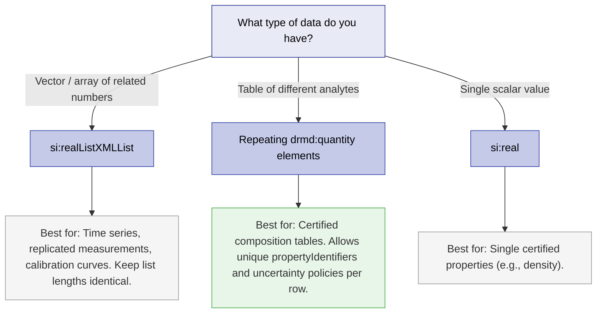

# Units, Quantities & Uncertainty Policy

The schema allows multiple quantity representations, but true machine interoperability requires a clear policy on how numbers and units are encoded. 

To ensure consistent interpretation across different platforms, this best practice relies heavily on the **Digital System of Units (D-SI)** to express unit strings unambiguously.

---

## 11.1 Unit String Policy (`si:unit`)

In the DRMD structure, unit strings appear primarily in `si:real/si:unit` and list variants. For machine-readability, all unit strings SHOULD follow the exact D-SI encoding syntax.

### 11.1.1 D-SI Syntax Rules

| Rule | Description |
|------|-------------|
| **Format** | Unit strings MUST be UTF-8 compatible. Identifiers for units and prefixes are ASCII, strictly lowercase, and prefixed with a backslash (e.g., `\metre`, `\micro`). |
| **Multiplication** | Units are combined by sequential concatenation. For example, `\kilo\metre\hour\tothe{-1}` represents $km/h$. |
| **Exponents** | Exponents are applied using the `\tothe{EXPONENT}` operator. No spaces are allowed inside the braces. Exponents must be decimal numbers (e.g., `2`, `-3`, `0.5`). |
| **Numeric Separator**| Numerical values associated with units **MUST** use a decimal dot (`.`) as the separator. `NaN` and `INF` are forbidden. |

### 11.1.2 Allowed Units (Examples)

- **SI Base Units:** `\metre`, `\kilogram`, `\second`, `\ampere`, `\kelvin`, `\mole`
- **Derived SI Units:** `\newton`, `\joule`, `\pascal`, `\watt`, `\volt`, `\degreecelsius`
- **Accepted Non-SI Units:** `\hour`, `\day`, `\tonne`, `\litre`, `\electronvolt`
- **Dimensionless:** `\one` (Must not be used with exponents or prefixes).

!!! tip "Example Unit Strings"
    - **Micrometre ($\mu$m):** `\micro\metre`
    - **Square metre (m²):** `\metre\tothe{2}`
    - **Pascal (kg/(m·s²)):** `\kilogram\metre\tothe{-1}\second\tothe{-2}`
    - **Milliampere hour (mAh):** `\milli\ampere\hour`

---

## 11.2 Prefix Policy

Prefixes represent decimal multiples or submultiples. D-SI enforces strict rules to prevent ambiguity during automated calculations:

- **Single Prefix Rule:** Each unit term MUST have no more than one prefix.
- **Double Prefixes Forbidden:** `\milli\kilo` is invalid.
- **Kilogram Rule:** `\kilogram` is special and **MUST NOT** be combined with an additional prefix.
- **Base Grams:** Multiples/submultiples of mass must be formed using `\gram` (e.g., `\milli\gram`, `\mega\gram`). You cannot use `\kilo` with `\gram`.
- **Forbidden Prefix Combinations:** Units like `\one`, `\degreecelsius`, `\hour`, and `\day` must never take a prefix.

---

## 11.3 D-SI Quality Classes

To make automated extraction reliable, D-SI defines quality classes. This aligns with the DRMD Interoperability Profiles (A, B, and C):

| Class | Requirements | DRMD Mapping |
|-------|--------------|--------------|
| **Platinum** | *Next Generation:* Only SI base units, `\one`, and specific time units. **No prefixes allowed.** | Profile B (Certified Values) |
| **Gold** | SI units with prefixes and derived SI units. | Profile B (Certified Values) |
| **Silver** | Adds non-SI units permitted for use with SI (e.g., `\litre`, `\tonne`). | Profile A (Minimum Core) |

---

## 11.4 Uncertainty Rules

For `si:real`, uncertainty is represented optionally via `si:measurementUncertaintyUnivariate`. 

!!! danger "Schematron Enforcement: RMC-006"
    If a document claims the CRM profile (i.e., the `properties` block has `@isCertified="true"`), Schematron Rule **RMC-006** strictly enforces that certified property values expressed as `si:real` quantities **MUST** include measurement uncertainty.

### 11.4.1 Minimum Recommended Uncertainty Structure
When providing uncertainty for a certified value:
1. `si:valueExpandedMU` (expanded uncertainty value) **SHOULD** be present.
2. At least one of `si:coverageFactor` ($k$) or `si:coverageProbability` (e.g., $0.95$) **SHOULD** be present.
3. `si:distribution` (e.g., "normal") MAY be provided.

```xml
<si:real>
  <si:value>49.5</si:value>
  <si:unit>\percent</si:unit>
  <si:measurementUncertaintyUnivariate>
    <si:expandedMU>
      <si:valueExpandedMU>1.3</si:valueExpandedMU>
      <si:coverageFactor>2</si:coverageFactor>
      <si:coverageProbability>0.95</si:coverageProbability>
      <si:distribution>normal</si:distribution>
    </si:expandedMU>
  </si:measurementUncertaintyUnivariate>
</si:real>
```

---

## 11.5 Lists vs Multiple Quantities

The DRMD schema supports expressing tabular compositional data in multiple ways. Use the following logic tree to decide the most interoperable approach:



!!! tip "Consistency is Key"
    Within one result table, **do not mix** list-encoded (`si:realListXMLList`) and row-encoded (`drmd:quantity`) styles. Prefer repeating `drmd:quantity` for standard Certified Reference Material composition tables.
