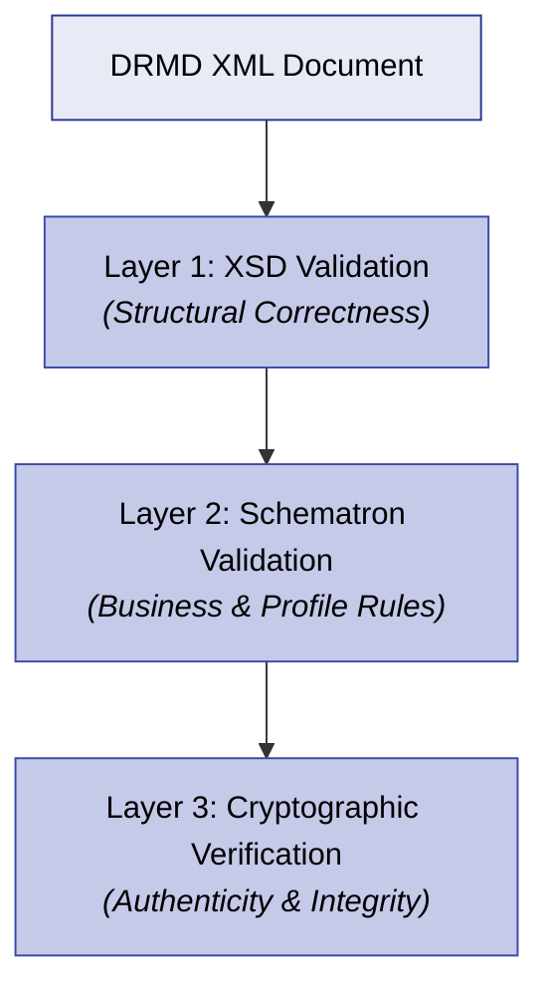

# Validation Rules & Severity Levels

XML Schema (XSD) validation ensures that a DRMD document is structurally correct, but structural correctness is not sufficient to guarantee machine-readability, interoperability, or certification-grade completeness.

With the recent introduction of the comprehensive `drmd-business-rules.sch` (Schematron) file, the validation workflow has completely evolved. Validation is now strictly enforced across three distinct layers:



The validation rules in this chapter are intended for:
- **Reference Material Producers** (to validate before publishing).
- **Software Vendors** (to validate before importing).
- **Laboratories & Auditors** (to evaluate completeness and traceability).

---

## 12.1 Layer 1: XSD Validation (Structure)

### What XSD validation MUST do
A DRMD validator MUST validate the XML document against the official `drmd.xsd` schema and resolve imports for dependencies (like `dcc.xsd` and `SI_Format.xsd`). It enforces `xs:sequence` ordering and rejects documents that violate required cardinalities or data types.

### What XSD validation does NOT guarantee
Because XSD is purely structural, it **cannot** guarantee:
- That textual fields are non-empty and meaningful.
- That `si:unit` strings conform to D-SI syntax rules (because `si:unit` is typed simply as `xs:string`).
- That uncertainties are present for certified values.
- That digital signatures are cryptographically valid (it only checks that the `ds:Signature` stub is syntactically allowed).

!!! danger "The XSD limitation"
    Because of these strict limitations, a document can easily be "XSD-valid" while remaining entirely non-interoperable. This is why **Layer 2 (Schematron)** was introduced.

---

## 12.2 Layer 2: Schematron Validation (Business Rules)

This layer relies on the **`drmd-business-rules.sch`** file. Schematron validation evaluates the business logic, profile expectations (Chapter 9), identifier conventions (Chapter 10), and unit/uncertainty policies (Chapter 11) that XSD cannot enforce.

A DRMD validator SHOULD run Schematron validation immediately after a successful XSD validation.

### Key Rule Categories Enforced by Schematron

| Category | Example Enforcement |
|----------|---------------------|
| **Core Presence** | Enforces that required statements (`intendedUse`, `storageInformation`, `instructionsForHandlingAndUse`) actually contain non-empty `dcc:content`. |
| **Profile Logic** | Enforces the distinction between CRM documents (which require `@isCertified="true"`) and Product Information Sheets (PIS) which forbid it. |
| **Uncertainty Policy** | Strictly enforces (`RMC-006`) that any certified value expressed as `si:real` includes an expanded uncertainty block. |
| **D-SI Unit Syntax** | Validates that `si:unit` strings use the correct prefix formatting, do not contain double prefixes, and use proper exponents without spaces. |

---

## 12.3 Error Severity Taxonomy

When evaluating a document, the validator SHOULD classify findings using a strict taxonomy:

### 12.3.1 ERROR
**Must not accept / Must fail conformance**

Use ERROR when XSD validation fails, required elements are missing entirely, operational statements are completely empty, or strict CRM profile requirements are violated.
*Examples:*
- Missing `storageInformation`.
- A certified quantity lacks measurement uncertainty.
- A D-SI string contains a forbidden double prefix (e.g., `\milli\kilo\gram`).

### 12.3.2 WARNING
**Acceptable but reduces interoperability/quality**

Use WARNING when the document is structurally valid but misses recommended best practices, or when D-SI quality classes are lower than expected.
*Examples:*
- `materialIdentifiers` are missing.
- A CRM document lacks a narrative traceability statement (`RMC-001`).

### 12.3.3 INFO
**Informational diagnostics**

Use INFO for additional helpful observations that do not indicate non-conformance.
*Examples:*
- An embedded PDF (`drmd:document`) is very large.
- A digital signature is present but cryptographic verification was skipped.

---

## 12.4 Suggested Validation Report Format

A robust DRMD validator SHOULD emit a machine-readable JSON conformance report preserving exact XPaths for easy debugging.

### Example JSON Template

```json
{
  "documentId": "BAM-CRM-M308a-2026",
  "schemaVersion": "0.2.0",
  "xsd_valid": true,
  "profile_target": "B",
  "profile_achieved": "A",
  "signature_verification": "not_present",
  "issues": [
    {
      "severity": "WARNING",
      "rule_id": "BP12-PROFILEB-TRACEABILITY-MISSING",
      "profile": "B",
      "category": "profile",
      "path": "/drmd:digitalReferenceMaterialDocument/drmd:statements/drmd:metrologicalTraceability",
      "message": "Profile B recommends providing a metrological traceability statement, but it is missing."
    },
    {
      "severity": "ERROR",
      "rule_id": "BP12-DSI-DOUBLEPREFIX",
      "profile": "A",
      "category": "dsi",
      "path": "/.../si:unit",
      "message": "Invalid D-SI unit string: double prefix is forbidden.",
      "context": { 
        "unit": "\\milli\\kilo\\gram" 
      }
    }
  ]
}
```

### Tabular Report Alternative
If JSON is not feasible for the end user, a validator SHOULD emit a human-readable table containing:
`Severity` | `Rule ID` | `Profile` | `Path` | `Message` | `Observed Value`
