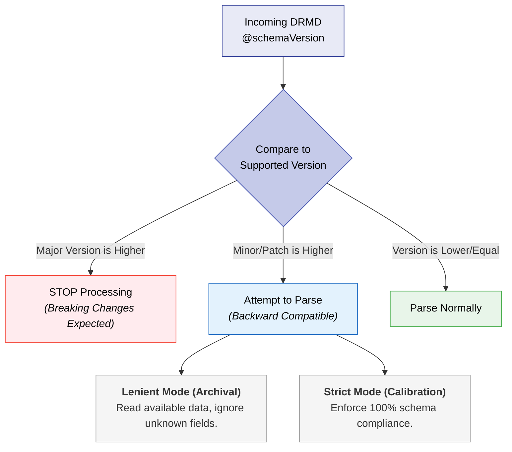

# Versioning & Backward Compatibility

Managing changes effectively prevents **"digital decay"**—where older certificates become unreadable by newer software, or newer certificates are suddenly rejected by legacy laboratory instruments.

This chapter defines the semantic versioning logic of the DRMD schema and the operational rules for updating certificates.

---

## 15.1 Breaking vs. Non-Breaking Changes

The DRMD follows strict semantic versioning logic to signal the impact of schema updates to developers.

| Change Type | Version Increment | Description |
|-------------|-------------------|-------------|
| **Breaking** | **Major** (e.g., `0.x` to `1.x`) | Renaming mandatory elements, changing the data type of a value, or removing existing fields. |
| **Non-Breaking**| **Minor** (e.g., `0.3` to `0.4`) | Adding optional elements or introducing new identifier schemes. Existing parsers will not break. |
| **Correction** | **Patch** (e.g., `0.3.0` to `0.3.1`)| Fixing typos in documentation or schema annotations without changing the XML structure. |

---

## 15.2 Handling Unknown Schema Versions

Software **MUST** implement version checking by inspecting the `@schemaVersion` attribute on the `drmd:digitalReferenceMaterialDocument` root element.

### Strict vs. Lenient Parsing Modes
It is highly recommended that parsers offer two modes:
- A **lenient mode** for archival viewing (reading whatever is possible, ignoring unknown optional fields added in minor updates).
- A **strict mode** for automated machine calibration (ensuring 100% schema compliance before trusting the values).

---

## 15.3 Migration Guidance

When a Reference Material Producer (RMP) updates a certificate or migrates to a new DRMD schema, the following operational rules apply:

1. **Document Re-issuance:** Any change to the technical content (e.g., a revised certified value) requires a completely new `uniqueIdentifier` (UUID) to be issued. You cannot quietly patch certified data.
2. **Stable Identifiers:** Even if a document is updated to a new version, the `materialIdentifiers` (like a batch number or catalog ID) SHOULD remain completely unchanged to maintain the link to the physical material.
3. **Upgrading Stored DRMDs:** When migrating a database of old DRMDs to a new schema version, software SHOULD preserve the original XML and the original digital signature as a "record of origin" before generating the transformed version.

---

## 15.4 Deprecation Policy

Fields or identifier schemes that are no longer recommended (e.g., an outdated unit string format or a decommissioned database link) will enter a strict "Deprecation" phase.

- **Warning Period:** Deprecated fields will remain in the schema for at least one Minor version cycle but will trigger a `WARNING` during Schematron Profile validation.
- **Removal:** Fields will only be actively removed in Major version updates.
- **Replacement:** Official documentation MUST provide a clear mapping from the deprecated field to the new recommended field to assist developers in updating their parsers.

---

## 15.5 Summary for Stakeholders

| Stakeholder | Best Practice |
|-------------|---------------|
| **Producers** | Always use the latest patch version for stability; never reuse a UUID for a modified document. |
| **Developers** | Implement "Future-Proof" parsing that gracefully ignores unknown optional elements in minor version updates. |
| **Laboratories** | Ensure your LIMS can store multiple versions of a certificate to maintain a complete, unbroken audit trail. |
